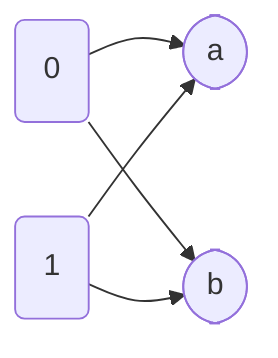

# 离散数学（下）

- [离散数学（下）](#离散数学下)
  - [Relations](#relations)
    - [Binary Relation](#binary-relation)
      - [Function as Relations](#function-as-relations)
      - [Relation on a Set (集合上的关系)](#relation-on-a-set-集合上的关系)
      - [Property of Relations](#property-of-relations)
      - [Combining Relations](#combining-relations)
    - [n元关系（n-ary Relations）](#n元关系n-ary-relations)
      - [n-ary and Database](#n-ary-and-database)
      - [Operations on n-ary Relations](#operations-on-n-ary-relations)
      - [Data Mining](#data-mining)
    - [Representing Relations](#representing-relations)
      - [Representing Relations Using Matrices](#representing-relations-using-matrices)
      - [Representing Relations Using Digraphs](#representing-relations-using-digraphs)
    - [Closures of Relations](#closures-of-relations)
      - [Paths in Directed Graphs](#paths-in-directed-graphs)
      - [Transitive Closures](#transitive-closures)
        - [Warshall’s Algorithm(沃舍尔算法)](#warshalls-algorithm沃舍尔算法)
    - [Equivalence Relations（等价关系）](#equivalence-relations等价关系)
      - [Equivalence Relations](#equivalence-relations)
      - [Equivalence Classes（等价类）](#equivalence-classes等价类)
      - [Equivalence Classes and Partitions（等价类与划分）](#equivalence-classes-and-partitions等价类与划分)
    - [Partial Orderings](#partial-orderings)
      - [Lexicographic Order](#lexicographic-order)
      - [Hasse Diagrams(哈塞图)](#hasse-diagrams哈塞图)
      - [Maximal and Minimal Elements(极大元和极小元)](#maximal-and-minimal-elements极大元和极小元)
      - [Lattices(格)](#lattices格)
      - [Topological Sorting (拓扑排序)](#topological-sorting-拓扑排序)
  - [Semigroups and Groups](#semigroups-and-groups)
    - [Binary Operations Revisited](#binary-operations-revisited)
      - [Properties of Binary Operation](#properties-of-binary-operation)
      - [Definitions](#definitions)
    - [Semigroups](#semigroups)
      - [Isomorphism and Homomorphism](#isomorphism-and-homomorphism)
    - [Products and Quotients of Semigroup](#products-and-quotients-of-semigroup)
    - [Group](#group)
    - [Products and Quotients of Groups](#products-and-quotients-of-groups)
  - [Groups and Coding](#groups-and-coding)
      - [Group Codes](#group-codes)
    - [Decoding and Error Correction](#decoding-and-error-correction)
  - [Advanced Counting Techniques](#advanced-counting-techniques)
    - [Applications of Recurrence Relations](#applications-of-recurrence-relations)
    - [Solving Linear Recurrence Relations](#solving-linear-recurrence-relations)
      - [Solving Linear Homogeneous Recurrence Relations with Constant Coefficients](#solving-linear-homogeneous-recurrence-relations-with-constant-coefficients)
      - [Linear Nonhomogeneous Recurrence Relations with Constant Coefficients](#linear-nonhomogeneous-recurrence-relations-with-constant-coefficients)
      - [Divide-and-Conquer Algorithms and Recurrence Relations](#divide-and-conquer-algorithms-and-recurrence-relations)
  - [Graphs](#graphs)
    - [Graphs and Graph Models](#graphs-and-graph-models)
      - [Graph Models](#graph-models)
    - [Graph Terminology and Special Types of Graphs](#graph-terminology-and-special-types-of-graphs)
      - [Basic Terminology](#basic-terminology)
      - [Some Special Simple Graphs](#some-special-simple-graphs)
      - [Bipartite Graphs 二分图](#bipartite-graphs-二分图)
      - [Bipartite Graphs and Matchings](#bipartite-graphs-and-matchings)
      - [New Graphs from Old](#new-graphs-from-old)
    - [Representing Graphs and Graph Isomorphism](#representing-graphs-and-graph-isomorphism)
      - [Isomorphism of Graphs](#isomorphism-of-graphs)
    - [Connectivity](#connectivity)
    - [Planar Graphs 平面图](#planar-graphs-平面图)
    - [Graph Coloring 图着色](#graph-coloring-图着色)
    - [Transport Network](#transport-network)
      - [Flow 流](#flow-流)
      - [Maximum Flows](#maximum-flows)
  - [附加](#附加)
    - [Permutation(置换函数)](#permutation置换函数)
      - [偶置换与奇置换](#偶置换与奇置换)

## Relations

### Binary Relation

* **Binary Relation**：$A$ 和 $B$ 是集合，A 到 B的二元关系（binary relation）是$A \times B$ 的子集。
* 设R为A、B的一个关系，记$a\ R\ b$ 表示 $(a,b) \in R$ 有序对$(a,b)$ 在关系中。$a$ be related to $b$ by R
* Example：$A = \{0,1,2\}$ and $B=\{a,b\}$  那么，$\{(0,a), (0,b), (1,a), (1,b)\}$ 为一个关系

* 逆关系(**inverse relation**) $R$ 是从$A$ 到$B$ 的关系，逆关系从$B$ 到 $A$ 记作$R^{-1}$ 使有序对的集合$\{(b,a)|(a,b)\in R\}$
* 互补关系(**complementary relation**) $\overline{R}$ 是有序对$\{(a,b)|(a,b) \notin R\}$

#### Function as Relations

* 函数是一个集合到另一个集合的映射，$A \to B$ ，B中元素满足$b \in B\ b = f(a)$，函数图像由$(a,b)$ 组成，即，图像是$A \times B$ 的子集，那么(a,b) 也是一个关系

#### Relation on a Set (集合上的关系)

* A Relation $A$ to $A$

#### Property of Relations

* **自反reflexive**：集合A上的一个关系，满足对所有的$a \in A$ 都有$(a,a) \in R$
* **反自反irreflexive**：$\forall a \in A, (a,a)\notin R$
* **对称Symmetric**：$\forall a,b \in A,\ (a,b) \in R \text{ and} (b,a) \in R$
* **反对称Antisymmetric**：$\forall a\neq b \in A,\ (a,b) \in R \text{ and} (b,a) \notin R$
* **非对称asymmetric**：$\forall a,b \in A,\ (a,b) \in R \text{ and} (b,a) \notin R$
* **传递性transitive**：对于关系$R\ \forall a,b,c \in A\ (a,b) \in R,\ (b,c) \in R,\ \text{ then } (a,c)\in R$

#### Combining Relations
* 关系是集合，也可做集合的运算，有 $R_1 \cup R_2\quad R_1 - R_2 \quad R_1 \cap R_2\quad R_1 \oplus R_2$等

* composite组合关系：$R: A\to B\quad S: B \to C$ 据此构造关系$A \to C$，记作$S \circ R$

* Power of Relations：$R^1 = R \quad R^n = R^{n-1} \circ R$
* 负指数： $R^{-n}=(R^{-1})^n $

* $A$上的关系$R$当且仅当$R^n \subset R$ 关系R是transitive的

### n元关系（n-ary Relations）

* 二元关系推广，n个集合$A_1,A_2\cdots A_n$ ，定义在这些集合上的关系是$A_1 \times A_2\times \cdots A_n$ 的子集，其中n个集合称为domain(域)，n称为degree（阶）

#### n-ary and Database
* **relational data model 关系数据模型**
* 数据库由**记录（record）**组成，这些记录是由**域（field）**构成的n元组，域是n元组的数据项
* 域的数量$n$ 就是**阶(degree)**
* **table**: 数据库中使用的关系也被称为表(table)
* **primary key主键**：domain of the n-ary relation 数据库中的n元组的某个域可以确定这个n元组，n元关系的这个域就称为主键（比如学生信息中的学号、身份证号)
* **extension 外延**：一个关系含有当前所有n元组称为该关系的外延
* **intension 内涵**：(或称其schema(架构、模式))数据库中更持久的内容，如：姓名、属性等称为内涵
* **composite key复合主键**：n元关系，域的组合也可以唯一标识n元组，当一组域可以确定关系n元组时，这些域的笛卡尔乘积称为复合主键

#### Operations on n-ary Relations

* selection operator $s_C$ 选择运算符：$R$ 为关系，$C$是$R$ 中元素可能满足的一个条件，选择运算符把R映射到R中所有满足选择条件n元组构成的n元关系。

* projection $P_{i_1 i_2\ldots i_m}$ 投影：把n元组$(a_1,a_2,\ldots,a_n)$ 变成m元组$(a_{i_1},a_{i_2},\ldots,a_{i_m})$ （相当于隐藏列）

* join $J_p(R,S)$ 连接：将两个关系同类的合并，不同类的按顺序接上。eg:

  Relation1:
  | Name | Course | Classroom |
  | ---- | ------ | --------- |

  Relation2:
  |Course | Classroom | Time |
  | ----- | --------- | ---- |

  Join:
  
  | Name | Course | Classroom | Time |
  | ---- | ------ | --------- | ---- |

#### Data Mining

* transaction 交易
* item 超市中的物品
* itemset：购买走的一系列物品
* k-itemset：有k个物品的itemset

### Representing Relations

#### Representing Relations Using Matrices

* $$
  m_{ij} = \left\{
  \begin{aligned}
  1 &\quad  \text{if} (a_i,b_j)\in R \\
  0 &\quad  \text{if} (a_i,b_j) \notin R
  \end{aligned}
  \right.
  $$

* 矩阵主对角线上都是1，则是自反（reflexive）的

* 矩阵为对称矩阵$M_R = (M_R)^T$ 关系是对称的

* 当$i \neq j$，$m_{ij}=0$ 或 $m_{ji} = 0$ 为反对称关系

* 关系运算
  $$
  M_{R_1 \cup R_2} = M_{R_1} \vee M_{R_2} \qquad M_{R_1 \cap R_2} = M_{R_1} \wedge M_{R_2}
  $$

* 关系合成的矩阵
  $$
  M_{S\circ R} = M_R \odot M_S
  $$

| 关系特征 | 关系图特征 | 关系矩阵特征 |
| :--------: | :----------: | :----------: |
| 自反 | 每一节点处有一环 | 对角线元素均为1 |
| 反自反 | 每一结点无环 | 对角线元素均为0 |
| 对称 | 两节点间有相反的两边同时出现| 对称矩阵|
| 反对称 | 两节点间没有相反的两边成对出现 | 当$C_{ij}=1(i \neq j)$时 $C_{ji} = 0$ |
| 传递 | 如果节点 $v_1 v_2$ 中有边，$v_2 v_3$ 中有边，$v_1 v_3$ 中必有边 | $R^n \subset R$

#### Representing Relations Using Digraphs

* 把有穷集看成有向图（directed graph、digraph）
* vertices(node) 顶点，edge(arcs) 边（弧），对于边$(a,b)$ a称为始点，b称为终点
* $(a,a)$ 这类的边称为环(loop)

### Closures of Relations

* $R$ 为一个关系，那么$R$ 的$P$闭包(**closure**) ，$P$ 是一个性质是一个最小的包含关系$R$ 和拥有性质$P$ 的关系。
* reflexive closure 自反闭包
* diagonal relation 对角关系 $\Delta = \{(a,a)|a \in A\}$ 
* $R$ 的自反闭包等于 $R\cup \Delta$
* symmetric closure 对称闭包
* 当且仅当$R$ 为对称闭包，$R$ 具有对称性

#### Paths in Directed Graphs

* $a$ 到 $b$ 的路径(**path**) 是一个边的序列$(x_0,x_1),\ (x_1,x_2),\ \ldots, (x_{n-1},x_n)$ 并且$x_0 = a \quad x_n = b$ 路径长度大于1，并且始点和终点相同被称为回路或回环(circuit or cycle)

* $R$ 是 $A$ 上的一个关系，有一个长度为$n$ 的路径，从a到b有且仅有 $(a,b) \in R^n$ 

  *证明：数学归纳、关系的合成*

#### Transitive Closures

* $R$ 是 $A$ 上的一个关系，连通性关系 (connectivity relation) $R^*$ 由$(a,b)$ 构成，使得在关系$R$ 中a到b存在一条长度至少为1的路径

* 由于$R^n$ 由有序对 $(a,b)$ 构成，使得存在一条从a到b的长为n的路径，所以 $R^*$ 是所有$R^n$ 的并集
  $$
  R^* = \bigcup_{n=1}^\infty R^n
  $$

* 关系$R$ 的传递闭包等于连通性关系 $R^*$ 

* **LEMMA：** $A$ 是含有n个元素的集合，R是A上的关系，如果有一条路径$a \to b$ 长度至少为1，那么两点存在长度不超过 $n$  的路径。若$a \neq b$ 那么长度不超过$n-1$

* $M_R$ 是定义在$n$ 个元素集合上的关系的0-1矩阵，那么传递闭包 $R^*$ 的矩阵
  $$
  M_{R^*} = M_R \vee M_R^{[2]}\vee M_R^{[3]} \vee \cdots \vee M_R^{[n]}
  $$

##### Warshall’s Algorithm(沃舍尔算法)

* interior vertices(vertex) 内部顶点：如果$a,x_1,x_2,\ldots,x_{m-1},b$ 是一条路径，内部顶点是$x_1,x_2,\ldots x_{m-1}$ 

* warshell：构造一系列矩阵：$W_0,W_1,W_2,\ldots,W_n$ 其中$W_0 = M_R$ 且 $W_k = [w_{ij}^{(k)}]$ ，如果存在一条从$v_i$ 到 $v_j$ 的路径使得这条路径的所有内部顶点都在集合 $\{v_1,v_2,\ldots v_k \}$ (前k个顶点) 那么 $w_{ij}^{(k)} = 1$ 否则为0，而$W_n = M_{R^*}$.

* 可以看出我们可以利用$W_{k-1}$ 得到 $W_k$ 因为从$v_i$ 到 $v_j$ 仅有两种情况：

  1. 从$v_i$ 到 $v_j$ 内部顶点是前$k-1$ 个顶点
  2. 从$v_i$ 到 $v_k$ 和从$v_k$ 到 $v_j$ 内部顶点是前$k-1$ 个顶点

  总结得到 $w_{ij}^{[k]} = 1$ 当且仅当 $w_{ij}^{[k-1]} = 1$ 或 $w_{ik}^{[k-1]} = 1$  且$w_{kj}^{[k-1]} = 1$ 

* **LEMMA：**$W_k = [w_{ij}^{[k]}]$ 的$(i,j)$ 位置为1当且仅当存在一条$v_i$ 到 $v_j$ 的路径，内部顶点取自集合$\{v_1,v_1,\cdots,v_k\}$ 那么
  $$
  w_{ij}^{[k]} = w_{ij}^{[k-1]} \vee(w_{ik}^{[k-1]} \wedge w_{kj}^{[k-1]})
  $$
  

### Equivalence Relations（等价关系）

#### Equivalence Relations

* $A$ 上的一个关系$R$ 如果是自反、对称和传递的，那么称关系是等价的(Equivlence Relation)
* 如果两元素$a$、$b$ 由于等价关系而关联，称他们是等价的，记作 $a \sim b$
* Congruence Modulo m 模m同余  是等价关系

#### Equivalence Classes（等价类）

* R是A上的等价关系，与A中一个元素$a$ 有关系的所有元素的集合称为$a$ 的等价类，a关于R 的等价类记作$[a]_R$，只考虑一个关系可省去下标。
  $$
  [a]_R = \{s|(a,s)\in R\}
  $$
  如果$b \in [a]_R$ 称$b$ 为该等价类的**代表元(representative)** 等价类的任何元素都可以作为该类的代表元

* 模m同余关系的等价类为**模m同余类(congruence classes modulo m)**

#### Equivalence Classes and Partitions（等价类与划分）

* R是定义在集合A上的等价关系，则
  $$
  aRb \qquad [a]=[b] \qquad [a]\cap[b] \neq \varnothing
  $$
  等价

* 由以上结论可以用来划分集合。R所有等价类的并集就是集合A，那么这些等价类相等或不相交，因为当$[a]_R \neq [b]_R$ 时，$[a]_R \cap [b]_R = \varnothing$ 

* 等价类构成集合的划分，集合的 **划分( partition)** 是$A$ 的不相交非空子集构成的集合，当且仅当
  $$
  A_i \neq \varnothing \quad i \in I\\
  A_i \cap A_j = \varnothing\\
  \bigcup_{i \in I} A_i = A
  $$

* 对于划分，每个等价类组成新的集合称为A关于R的 **商集(quotient set)** ，记作 $A/R$  （所有等价类的集合）
* 商集元素个数(A在R下等价类的个数) 称为R的**秩(rank)**

* R是定义在集合S上的等价关系，那么R的等价类构成S的划分，反过来，给定集合S的划分$\{A_i|i\in I\}$，则存在一个等价关系，依集合$A_i (i \in I)$ 作为它的等价类

### Partial Orderings

* **Partial Ordering（Partial Order）** 定义在集合$S$ 上的关系$R$ 如果是自反、反对称、传递的，就称为偏序；集合$S$ 和定义在其上的偏序$R$ 一起称为偏序集（**partially ordered set, or poset**），记作$(S,R)$ 集合$S$ 中的元素称为偏序集的元素。

* 在一个偏序集中，使用$a \preceq b$ 表示$(a,b)\in R$，其中$\preceq$ 表示任意偏序关系，不仅仅是小于等于，记号$\prec$ 表示$a \preceq b$ 但 $a \neq b$

* 偏序集中，不一定所有的元素都有$a \preceq b$ 或 $b \preceq a$ 有可能两元素没有关系，因此，如果偏序集$(S,\preceq)$中元素$a \preceq b$ 或$ b \preceq a$ 称$a、b$ 是可比的（**comparable**），相反，如果没有$a \preceq b$ 也没有$ b \preceq a$ 称$a、b$ 是不可比的（**incomparable**）

* 如果偏序集中每对元素都是可比的，称 $S$ 为全序集（**totally ordered** or **linearly ordered set**），$\preceq$ 称为全序或线序（ **total order** or **a linear order**）一个全序集也称为链(**chain**)

* 对于偏序集$(S,\preceq)$ 如果$\preceq$ 是全序，并且对于$S$ 每个非空子集都有一个最小元素，称其为良序集（**well-ordered set**）

* 全序集不一定是良序集，如实数的开区间： $(a,b)$

* **良序归纳原理(THE PRINCIPLE OF WELL-ORDERED INDUCTION)** ：假设$S$ 是一个良序集，那么$P(x)\quad \forall x \in S$ 如果满足：

  *INDUCTIVE STEP:* $\forall y \in S$ ，如果 $\forall x \in S$ 满足$x \prec y$ 时$P(x)$ 为真，那么 $P(y)$ 为真
  
  这个结论很显然，因为对于最小元素$x_0$，没有比它小的，利用假设和空证明可以证明 $\forall x \prec x_0 \ P(x)$ 为真，那么最小元素 $P(x_0)$ 为真，那么所有都为真

#### Lexicographic Order

* 字典序(**Lexicographic Order**) 如果第一个有序对第一个元素小于第二个有序对第一个元素，或两个第一个元素相等，但第一个有序对的第二个元素小于第二个有序对的，那么第一个有序对小于第二个有序对
  $$
  (a_1,a_2) \prec (b_1,b_2)
  $$
  加上相等关系，就得到偏序$\preceq$ ，该关系还可表示为$a_1 \prec_1 b_1$ 或$a=b \quad a_2 \prec_2 b_2$

* 同样的可以定义$n$ 个偏序集$(A_i, \preceq)$ 的笛卡尔乘积上的字典序
  $$
  (a_1,a_2,\ldots,a_n) \prec (b_1,b_2,\ldots,b_n)
  $$
  如果$a_1 \prec_1 b_1$ 或$\exists i>0 \quad s.t. \quad a_1=b_1,\ldots a_i = b_1 \quad and \quad a_{i+1} \prec_{i+1} b_{i+1}$

* 定义字符串的字典序，考虑偏序集上的字符串$a_1a_2\cdots a_m$ 和 $b_1b_2\cdots b_n$，设$t = \min(n,m)$，那么$a_1a_2\cdots a_m$ 小于 $b_1b_2\cdots b_n$ 当且仅当
  $$
  (a_1,a_2,\cdots,a_t) \prec (b_1,b_2,\cdots,b_t) \text{ 或者}\\
  (a_1,a_2,\cdots,a_t) = (b_1,b_2,\cdots,b_t) \text{ 并且 } m<n
  $$

#### Hasse Diagrams(哈塞图)

* 对于有穷偏序集的有向图，某些必定有的结构可以不用画，去除掉自反关系有的环，去掉由于传递关系多出来的边，最后得到哈塞图，如图显示的集合$\{1,2,3,4\}$ 上的偏序$\{(a,b)|a \leq b\}$ 

  

* 设偏序集$(S,\preceq)$ 若$x\prec y$ 且不存在 $z\in S \quad s.t.\ x \prec z \prec y$ 称元素$y \in S$ 覆盖(**covers**) 元素$x \in S$，y覆盖x的有序对$(x,y)$ 的集合称为$(S,\preceq)$ 的覆盖关系(**covering relation**)
* 以上描述可以得到偏序集的哈塞图中的边，是向上的边并且与$(S,\preceq)$ 的覆盖关系中的有序对对应。并且我们可以从偏序集中的覆盖关系得到这个偏序集

#### Maximal and Minimal Elements(极大元和极小元)

* 当不存在 $b \in S$ 使得 $a \prec b$ 则$a$ 为极大元(**maximal**)，同理，不存在 $b \in S$ $b \prec a$ $a$ 为极小元(**minimal**)，一个集合可以有多个极大、极小元
* 偏序集中有一个元素大于每个其他元素，称为**最大元(greatest element)** 记作 $I$ 有时也被称为**单位元(unit element)** 同理有最小元(**least element**) 记作 $0$ 也被称为 **零元(zero element)**
* 对于偏序集 $(S,\preceq)$ 的子集$A$，如果 $u \in S$ 满足 $\forall a \in A$ 有 $a \preceq u$ 称 $u$ 为$A$ 的一个上界(**upper bound**)，类似的也有下界(**lower bound**)
* $x$ 是上界且小于$A$ 的任何其他上界，称其为最小上界(**least upper bound**)，同样，有最大下界(**greatest lower bound**)，分别记作 $\text{glb}(A)$ 和 $\text{lub}(A)$
* 将 $\text{lub}(\{a,b\})$ 记作 $a \vee b$ 并称其为a、b的**并(join)**
* 将 $\text{glb}(\{a,b\})$ 记作 $a \wedge b$ 并称其为a、b的**交(meet)**

#### Lattices(格)
* 一个偏序集每对元素都有最小上界和最小下界，称该偏序集为格(**lattice**)
* 如果 $L$ 是格，那么 $\forall a,b \in L$
  * $a \vee b = b$ 当且仅当 $a \leq b$
  * $a \wedge b = a$ 当且仅当 $a \leq b$
  * $a \wedge b = a$ 当且仅当 $a \vee b = b$
* 如果称格是**有界的(bounded)** 那么它有一个上界，记作$1$，一个下界记作$0$
* 对于一个格
  * **Idempotent Properties（等幂律）**
    * $a \vee a = a$
    * $a \wedge a = a$
  * **Commutative Properties（交换律）**
    * $a \vee b = b\vee a$
    * $a \wedge b = b \wedge a$
  * **Associative Properties（结合律）**
    * $a \vee (b \vee c) = (a \vee b)\vee c $
    * $a \wedge (b \wedge c) = (a \wedge b) \wedge c $
  * **Absorption Properties（吸收律）**
    * $a \vee(a \wedge b) = a $
    * $a \wedge (a \vee b) = a$
* $L$ 是一个格，那么 $\forall a,b,c \in L$
  * 如果 $a \leq b$
    * $a \vee c \leq b \vee c$
    * $a \wedge c \leq b \wedge c$
  * $a \leq c$ & $b \leq c$ 当且仅当 $a \vee b \leq c$
  * $c \leq a$ & $c \leq b$ 当且仅当 $c \leq a \wedge b$
  * 如果 $a \leq b$ & $c \leq d$
    * $a \vee c \leq b \vee d$
    * $a \wedge c \leq b \wedge d$
* $L = \{a_1,a_2,\cdots ,a_n\}$ 是一个格，那么L是有界的
  * 最大的元素是 $a_1 \vee a_2 \vee \cdots \vee a_n$
  * 最小的元素是 $a_1 \wedge a_2 \wedge \cdots \wedge a_n$
* 格如果满足 $\forall x,y,z \in L \quad x \vee (y \wedge z) = (x \vee y) \wedge (x \vee z) \quad \&\& \quad (x \wedge y) \vee (x \wedge z) $ 就称其是**分配的(distributive)**
* 格是**不分配的(nondistributive)** 当且仅当它包含一个**子格(sunlattice)** 是上述两个格的其中一个的同构
* 有界格元素a关于上界$1$和下界$0$的**补元(complement)**$b$： $a \vee b = 1$ 并且 $a \wedge b =0$. 如果一个格每个元素都有补元，这个格称为有**补格(complemented)**
* L是一个有界的分配的格，如果其中的元素的补元存在，那么就是唯一的

#### Topological Sorting (拓扑排序)
* 如果只要$aRb$ 就有$a \preceq b$ 则称一个全序$\preceq$ 与偏序$R$ 是相容的(**compatible**) ，从一个偏序构造一个相容的全序称为拓扑排序(**topological sorting**)
* LEMMA：每个非空有穷非空偏序集$(S,\preceq)$ 至少有一个极小元。
* 过程：
  1. 在偏序集$(A,\preceq)$ 中选择一个极小元素$a_1$ (因为至少有一个，也可能有多个，选取一个)
  2. 将$a_1$ 移出$A$，$(A - \{a_1\}, \preceq)$ 也是偏序集，如果是非空的，重复步骤
  3. 最终产生一个元素序列$a_1, a_2, \cdots, a_n$ 所需要的全序$\preceq_t$ 定义为 $$a_1 \prec_t a_2 \prec_t \cdots \prec_t a_n$$
   该过程重新定义了$\prec$ 使$A$ 中的元素满足该重新定义的规则形成全序
* dual of $(S,R)$ : 对偶，$(S,R^{-1})$

## Semigroups and Groups

### Binary Operations Revisited

* 需要一个对象的运算 **一元运算(unary operation)**
* 结合两个对象的运算 **二元运算(binary operation)**
* 集合 $A$ 上得二元运算，是一个处处定义的函数 $f:A \times A \to A$ 并且有如下性质
  * 每对 $(a,b)$ 都要有定义
  * 函数，故每个有序对只有一个值
* 我们常把二元运算 $f(a,b)$ 记作 $a*b$ ，并且对于 $\forall a,b \in A \quad a*b \in A$ 我们称在运算 $*$ 下， $A$ 是**封闭的**（**closed**）
* **EXAMPLE** ： $A=R$ 定义 $a*b$ 为 $a/b$ 不是二元运算，因为 b不能为0
* 可以用表格定义运算

| *  |  $a_j$ |
|---|---|
|  $a_i$ |  $a_i * a_j$ |

#### Properties of Binary Operation
* **commutative**： 交换的，如果对所有元素有 $a*b= b*a$
* 如果是交换的，那么二元运算的表格关于主对角线(main diagonal) 是对称的(symmetric)
* **associative** 结合的，如果对于所有元素有 $a*(b*c) = (a*b)*c$
* **Idempotent property** 幂等性质： $a = a*a$
* **Commutative property** 交换性质： $a*b = b*a$
* **Associative property** 结合性质： $a*(b*c) = (a*b)*c $
* **Distributive property** 分配律： $x * (y *' z) = (x*y) *' (y*z) $
* **De Morgan’s laws** 德摩根律： 某些结构有一元和二元运算，设$*$是一元，$\nabla$和$\Delta$ 是二元，则 $(x \nabla y)* =  x* \Delta y* \quad (x \Delta y)* = x* \nabla y* $

#### Definitions
* **单位元(Identity for an operation)** $\forall x \quad x *e = e * x = x$，把$x$称作该运算的单位元，*运算的单位元唯一*
* **逆元(inverse)** 如果二元运算有一个单位元$e$，如果有 $x * y = y*x = e$ 我们称$y$ 是$x$ 的逆元
* 如果$*$是一个结合的二元运算并且$x$ 有一个关于$*$ 的逆元$y$，那么$y$是唯一的

### Semigroups
* **semigroup** 半群，是非空集合 $S$ 和定义在该集合上的可结合的二元运算 $*$ ， 用 $(S,*) $ 表示半群，或者当运算 $*$ 确定时，简记为$S$。  我们也把 $a*b$ 称为 $a$ 和 $b$ 的**积**(**product**). 如果 $*$是交换运算，称 $(S,*) $ 为**交换半群**(**commutative semigroup**)
* 附加：一个集合 $A$ ，构造一个由A中元素的所有有限序列构成的集合 $A^* $ ，集合A往往不是数集而是由符号构成的集合，这种情况下 A称为一个 **字母表** (**Alpha Bet**)， $A^* $中的有限序列称为 $A$ 的**字** (word) 或**字符串**(string)， 如果 $A^*$ 包含空序列，用 $\wedge$ 表示这种串
* 设 $\alpha \quad \beta$ 是 $A^*$ 的元素， **连接(catenation)** 是 $A^*$ 上的一个二元运算 $\cdot$ 容易得到，如果 $\alpha \quad \beta \quad \gamma$ 是任意元素，那么
  $$
  \alpha \cdot (\beta \cdot \gamma) = (\alpha \cdot \beta) \cdot \gamma
  $$
  因此 $\cdot$ 是一个结合二元运算， $(A^*,\cdot) $ 是一个半群，称其为由**A产生的自由半群** (**free semigroup generated by A**)

* **定理：** 如果 $a_1,a_2,\cdots, a_n(n \geq 3)$ 是半群中任意元素，那么在由元素形成的积中任意插入有意义的括号，积的结果都是相等的
* **EXAMPLE：** $((a_1 * a_2)*a_3)*a_4 $ ， $a_1*(a_2*(a_3*a_4)) $ 等都是相等的
* 半群中的一个元素 $e$ 如果 $\forall a \in S \quad e*a = a*e = a$ 那么称它为**单位元(identity)(幺元)** 单位元唯一
* 如果 $e*a = a$ 称为左幺元，同理有右幺元
* **幺半群(monoid)** 是一个有单位元的半群
* 设 $(S,*)$ 是一个半群， $T$ 是 $S$ 的一个子集，如果T在运算 $*$下是封闭的，那么称 $(T,*) $ 是 $(S,*) $ 的 **子半群(subsemigroup)** 
* 类似的如果S有单位元，且T有单位元，称为 **子幺半群(submonoid)**(子独立点)
* Power of a
  1. 假定 $(S,*) $ 是一个半群， $a \in S$ ， $n \in Z^+$
  2. 递归定义a的幂：
    * $a^1 = a $  $a^{n} = a^{n-1} *a$
    * $a^0 = e$ 如果S是幺半群
    * 如果m、n是非负整数那么 $a^m * a^n = a^{m+n}$
#### Isomorphism and Homomorphism
* 设 $(S,*)$ 和 $(T,*')$ 是两个半群，如果函数 $f:S\to T$  是 S到T 的一个一一对应，并且对S中所有的a、b有 $f(a*b) = f(a)*'f(b) $ 则称 $f:S\to T$ 是 $(S,*)$ 到 $(T,*')$ 的一个 **同构(isomorphism)**
* 可以证明 $f^{-1}$ 是从 T到S的一个同构
* 此时称 $(S,*)$ 和 $(T,*') $ 是 **同构的(isomorphic)** ，记为 $S \simeq T$
* 证明两半群同构。步骤：
  1. 定义一个函数 $f: S\to T \quad  \text{Dom}(f) = S$
  2. 证明 $f$ 是单射
  3. 证明 $f$ 是满射
  4. 证明 $f(a*b) = f(a)*' f(b)$
* **定理：** 设 $(S,*) $ 和 $(T,*') $ 分别有单位元 $e \quad e'$ ， $f:S\to T$ 是一个同构，那么 $f(e) = e'$
* 设 $(S,*)$ 和 $(T,*')$ 是两个半群，如果函数 $f:S\to T$ 对S中所有的a、b有 $f(a*b) = f(a)*'f(b) $ 则称 $f$ 是从 $(S,*) $ 到 $(T,*') $ 的一个**同态(homomorphism)** 如果 $f$ 还是满射的(onto)，那么称 T是S的 **同态象(homomorphism image)**
* 同态与同构的差异是*同构必须是单射和满射的*
* **定理：** 设 $(S,*) $ 和 $(T,*') $ 分别有单位元 $e \quad e'$ ， $f:S\to T$ 是一个同态并且是满射的，那么 $f(e) = e'$
* 显然该定理比之前的定理更强，因为条件更弱
* $f$ 是$((S,*) \to (T,*'))$ 的同态映射，如果 $S'$ 是S的子半群，那么 $f(S') = \{t \in T|t = f(s)\exists s \in S'\} $，S'在f作用下的像(image)是T的子半群
* **定理：** 如果 $f$ 是交换半群 $(S,*)$ 到半群 $(T,*')$ 的一个同态且满射，那么 $(T,*') $ 也是交换半群

### Products and Quotients of Semigroup
* 如果 $(S,*) $ 和 $(T,*') $ 是半群，那么 $((S \times T),*'') $ 是一个半群，其中 $*''$ 由 $(s_1, t_1) *'' (s_2,t_2) = (s_1*s_2, t_1*'t_2) $ 定义
* 如果是幺半群，那么有 $S\times T$ 是幺半群，并且有单位元为 $(e_S,e_T)$
* 一个半群上的等价关系 $R$ 如果满足
$$
a R a' \quad \text{and} \quad b R b' \quad \Rightarrow \quad (a*b) R (a' * b')
$$
称为 **同余关系(congruence relation)** 

* 由关系的知识有 半群上的等价关系 $R$ 决定 $S$ 的一个划分(partition). 设 $[a] = R(a)$ 是包含 $a$ 的等价类， $S/R$ 表示所有等价类的集合(划分)，这种背景下更常用记号 $[a]$
* **定理：** 设 $R$ 是半群 $(S,*)$ 上的一个同余关系，在有序对 $([a], [b])$ 和 $[a*b]$ 有关时，考虑从 $S/R \times S/R$ 到 $S/R$ 的关系 $\circledast$ .
  1. $\circledast$ 是从 $S/R \times S/R$ 到 $S/R$ 的一个函数，通常用 $[a] \circledast [b]$ 表示 $\circledast ([a],[b])$ ，有 $[a] \circledast [b] = [a * b]$
  2. $(S/R, \circledast) $ 是一个半群

* 称 $S/R$ 为**商半群(quotient semigroup)** 或 **因子半群(factor semigroup)** ，注意到 $\circledast$ 是一类 “商二元关系”， S/R由原来的二元关系构造而来的
* 推论：R是幺半群 $(S,*) $ 上的一个同余关系，如果通过 $[a] \circledast [b] = [a * b]$ 定义 $S/R$ 中的运算 $\circledast$ 那么 $(S/R, \circledast) $ 是幺半群 (如果e是单位元，可以验证$[e]$ 是$(S/R, \circledast)$ 的单位元)
* 我们习惯用 $Z_n$ 来表示 商集 $Z/\equiv (\text{mod} n)$ (将整数通过同余关系$\text{mod} n$划分)
* $Z_n$ 是有运算 $\oplus$ 和单位元 $[0]$ 的一个幺半群；运算 $\oplus$ 定义：$[a] \oplus [b] = [a+b] $
* 可以证明 $Z_n$ 通常有 $n$ 个等价类： $[0],[1],[2],\cdots ,[n-1] $
* R是半群上的一个同余关系，S/R 是对应的商半群，那么由 $f_R(a) = [a]$ 定义的函数 $f_R: S \to S/R$ 是一个同态，且是满射，称其为**自然同态(natural homomorphism)**
* **同态基本定理(Fundamental Homomorphism Theorem)** 设 $f:S\to T$ 是半群S到T的一个同态满射，R是S上的关系且定义为对于S中的a、b，当且仅当 $f(a) = f(b) $ 时 $aRb$ 那么
  1. R是一个同余关系
  2. $(T,*') $ 和商半群 $(S/R,\circledast) $ 是同构的 (同构为$\bar f:S/R \to T \quad \bar f([a])=f(a) $)
* 可以由一个图表示上述定理，定义 $\bar f \circ f_R = f$

### Group
* 一个**群(group)** $(G,*)$ 是一个由单位元的幺半群，并且满足 $\forall a \in G \quad \exists a' \in G \quad s.t. \ a * a' = e $
* 由定义有，群有如下性质
  1.  $\forall a,b,c \in G \quad (a*b)*c = a*(b*c) $
  2.  有唯一的元素$e$满足 $\forall a \in G \quad a*e = e*a = a$
  3.  $\forall a \in G \quad \exists a' \in G \quad a*a' = a'*a = e$  其中$a'$ 称为$a$的**逆(inverse)**

* 我们可以把乘积$a*b$ 简写作$ab$ ，群 $(G,*)$ 简写为$G$
* 群如果对所有元素满足 $ab = ba$ 那么被称为**阿贝尔的 (Abelian)** (交换的)
* **定理**：$G$ 是一个群，那么群里每个元素只有一个逆
* 我们把逆记作 $a^{-1}$
* 消去律：a、b、c是G中的元素
  * $ab = ac$ 那么 $b=c$ **左消去律(left cancellation property)**
  * $ba = ca$ 那么 $b=c$ **右消去律(right cancellation property)**
  * 证明：同时乘$a^{-1}$
* 逆满足如下运算律
  * $(a^{-1})^{-1} = a $
  * $(ab)^{-1} = b^{-1}a^{-1} $
* G是群，a、b是元素
  * 方程 $ax= b$ 在群中有唯一解
  * 方程 $ya= b$ 在群中有唯一解
* 如果G有有限个元素，那么可以通过表格来表示群的二元运算，表被称为**乘法表(multiplication table)**
* 用$e$标号的一行一定是 $a_1,a_2,\cdots,a_n$ ，列同理
* 由<a href="#theorem4">定理</a>可知每个元素$b$必须在每列和每行中出现一次(因为每一行、列不能有重复元素)，每行和每列是 $G$ 中元素 $a_1,a_2,\cdots,a_n$ 的一个排列(permutaton)
* 如果群有有限个元素，称G为**有限群(finite group)** ，G的**阶(order)** 是G中元素的个数$|G|$，以下确定阶为1、2、3、4的非同构群的乘法表
一阶：$G=\{e\}$
二阶：

|   | $e$  | $a$  |
|---|---|---|
| $e$  | $e$  | $a$  |
| $a$  | $a$  | $e$  |

三阶：可以证明只有下表满足群的性质

|   | $e$  | $a$  | $b$  |
|---|---|---|---|
| $e$  | $e$  | $a$  | $b$  |
| $a$  | $a$  | $b$  | $e$  |
| $b$  | $b$  | $e$  | $a$  |

四阶：可以证明以下四种满足群的性质，四阶的群是阿贝尔群，（本章末尾会证明仅有两个四阶非同构群）

|   | $e$  | $a$  | $b$  | $c$  |
|---|---|---|---|---|
| $e$  | $e$  | $a$  | $b$  | $c$  |
| $a$  | $a$  | $e$  | $c$  | $b$  |
| $b$  | $b$  | $c$  | $e$  | $a$  |
| $c$  | $c$  | $b$  | $a$  | $e$  |

|   | $e$  | $a$  | $b$  | $c$  |
|---|---|---|---|---|
| $e$  | $e$  | $a$  | $b$  | $c$  |
| $a$  | $a$  | $e$  | $c$  | $b$  |
| $b$  | $b$  | $c$  | $a$  | $e$  |
| $c$  | $c$  | $b$  | $e$  | $a$  |

|   | $e$  | $a$  | $b$  | $c$  |
|---|---|---|---|---|
| $e$  | $e$  | $a$  | $b$  | $c$  |
| $a$  | $a$  | $b$  | $c$  | $e$  |
| $b$  | $b$  | $c$  | $e$  | $a$  |
| $c$  | $c$  | $e$  | $a$  | $b$  |

|   | $e$  | $a$  | $b$  | $c$  |
|---|---|---|---|---|
| $e$  | $e$  | $a$  | $b$  | $c$  |
| $a$  | $a$  | $c$  | $e$  | $b$  |
| $b$  | $b$  | $e$  | $c$  | $a$  |
| $c$  | $c$  | $b$  | $a$  | $e$  |

* 对于三角形可以将其对称性写成**置换(permutation)** （有关置换，参见<a href="#附加">附加</a>）
  * 首先有旋转对称性，$f_1$ $f_2$ $f_3$ 对应其旋转0、120、240度的情况
  $$
  f_1 = \begin{pmatrix}
    1 & 2 & 3\\
    1 & 2 &3
  \end{pmatrix}
  \quad  
  f_2 = \begin{pmatrix}
    1 & 2 & 3\\
    2 & 3 & 1
  \end{pmatrix}
  \quad 
  f_3 = \begin{pmatrix}
    1 & 2 & 3\\
    3 & 1 & 2
  \end{pmatrix}
  $$

  * 其次有轴对称性，$g_1 ~ g_3$ 分别为关于 $l_1 ~ l_3$ 对称
  $$
  f_1 = \begin{pmatrix}
    1 & 2 & 3\\
    1 & 3 & 2
  \end{pmatrix}
  \quad  
  f_2 = \begin{pmatrix}
    1 & 2 & 3\\
    3 & 2 & 1
  \end{pmatrix}
  \quad 
  f_3 = \begin{pmatrix}
    1 & 2 & 3\\
    2 & 1 & 3
  \end{pmatrix}
  $$

  * 我们把这些置换记作 $S_3 = \{f_1, f_2, f_3, g_1, g_2, g_3\}$，同样可以列出乘法表

|       | $f_1$ | $f_2$ | $f_3$ | $g_1$ | $g_2$ | $g_3$ |
| ----- | ----- | ----- | ----- | ----- | ----- | ----- |
| $f_1$ | $f_1$ | $f_2$ | $f_3$ | $g_1$ | $g_2$ | $g_3$ |
| $f_2$ | $f_2$ | $f_3$ | $f_1$ | $g_3$ | $g_1$ | $g_2$ |
| $f_3$ | $f_3$ | $f_1$ | $f_2$ | $g_2$ | $g_3$ | $g_1$ |
| $g_1$ | $g_1$ | $g_2$ | $g_1$ | $f_1$ | $f_2$ | $f_3$ |
| $g_2$ | $g_2$ | $g_3$ | $g_1$ | $f_3$ | $f_1$ | $f_2$ |
| $g_3$ | $g_3$ | $g_1$ | $g_1$ | $f_2$ | $f_1$ | $f_2$ |

* 可以注意到 $f_1$ 是单位元，且每个元都有唯一逆，群 $S_3$ 被称为 **三角形对称群(group of symmetries of the triangle)**
* $n$ 个元素的置换群有 $n!$ 阶，被称为 **symmetric group on n letters(n 个字母上的对称群)** 记作 $S_n$
* 设 $H$ 是群$G$ 的一个子集满足
  1. $G$ 的单位元 $e$  属于 $H$
  2. 如果 $a,b \in H$ 那么 $ab \in H$
  3. 如果 $a\in H$ 那么 $a^{-1} \in H$
  则称$H$ 为$G$ 的**子群(subgroup)**

* $G$ 和$H=\{e\}$ 是 $G$ 的子群，称为**平凡子群(trival subgroup)**
* 设 $A_n$ 是群$S_n$中所有**偶置换(even permutation)** 的集合，它是 $S_n$ 的子群，称为 **n元交错群(alternating group on n letters)**
* **定理**： 设 $(G,*) $  $(G',*') $ 两个群，$f:G \to G'$ 是同态
  * 如果$e$ 是G的单位元，e' 是G' 的单位元那么 $f(e) = e' $
  * 如果 $a\in G$ 那么 $f(a^{-1}) = (f(a))^{-1} $
  * 如果 H是G的一个子群，那么 $f(H) = \{f(h)|h \in H\} $ 是G'的一个子群

### Products and Quotients of Groups

* $G_1、G_2$ 是群，那么群 $G=G_1\times G_2$ 的二元运算是 $(a_1,b_1) * (a_2,b_2) = (a_1*a_2, b_1*b_2) $
* 以上推广有，如果 $G_1,G_2,\cdots,G_n $ 是群，那么 $G_1\times G_2 \times \cdots G_n$ 也是一个群
* 群上的同余关系就是该群被看半群时的同余关系
* R是群 $(G,*) $ 上的一个同余关系，那么半群 $(G/R,\circledast) $ 是一个群，运算 $\circledast$ 满足 $[a] \circledast [b] = [a*b] $
* 如果 R是 群 G上的一个 同余关系，那么由 $f_R(a) = [a] $ 给出的函数 $f_R: G \to G/R $ 是群的同态(homomorphism)
* 如果 $f:G\to G' $ 是从群 $G$ 到 $G'$ 的一个同态且是满射，R是定义在 G上的关系满足 当且仅当 $f(a)=f(b) $ 有 $aRb$ ，那么
  1. R是一个同余关系
  2. 由 $\bar f([a]) = f(a) $ 给出的函数 $\bar f: G/R \to G' $ 是从群 $(G/R,\circledast) $ 到群 $(G',*') $ 的一个同构且是满射

* 设H是G的一个子群，$a \in G$ 由a决定的G中H的**左陪集(left coset)** 是 $aH = \{ah | h\in H\}$ ，同样有 **右陪集(right coset)** $Ha = \{ha|h\in H\} $ 最后，如果对G中所有的a都有 $aH=Ha$ 则称$G$ 的子群$H$ 是**正规子群(normal subgroup)**

* **注意**  如果$aH=Ha$ **并不能** 得到 $\forall h \in H \ a\in G \quad ha=ah$ ，只能得到 $ha=ah'$ 其中 $h'$ 是H中的一个元素
* **定理**：设$R$是群$G$上的一个同余关系，$H=[e]$，即包含单位元的等价类，那么H是G的一个正规子群，并且对每个$a\in G$，$[a]=aH=Ha$。
* 以上定理可看出 商群 $G/R$ 是由 $N=[e] $ 的所有左陪集组成的， $G/R$ 中的运算
$$
(aN)(bN) = [a] \circledast [b] = [ab] = abN
$$
并且由 $f_R(a) = aN $ 所定义的函数 $f_R:G\to G/R$ 是从G到G/R 的同态且满射，因此，常把 $G/R$ 写成 $G/N$

* **定理**：设N是群G的一个正规子群，R是G上的下述关系：$aRb$当且仅当$a^{-1}b=N$。
那么
  1. R是G上的同余关系。
  2. N是关于R的等价类$[e]$，其中e是G的单位元。

* 对上述定理第2点做如下解释：设 $f$ 是从群 $(G，*)$ 到群 $(G'，*')$上的同态并且是满射，$f$ 的核记做$\text{ker}(f)$，定义为：
$$
\text{ker}(f) = \{a \in G|f(a)=e' \}
$$
那么
  1. $\text{ker}(f)$ 是G的正规子群
  2. 商群 $G/\text{ker}(f) $ 与 $G'$ 是同构的

* 通过以上可知，如果 当且仅当$f(a) = f(b) \quad aRb$   那么易证 $\text{ker}(f)=[e] $

## Groups and Coding
* Coding theory has developed techniques for introducing redundant information(引入冗余信息) in transmitted data that help in detecting, and sometimes in correcting, errors.
* 信息的基本单位被称为**报文(message)**，它是一个有限字母表中字符的有限序列。可以选择字母表：集合 $B =\{0,1\}$ ，于是要传送的每一个字符或符号可表示为B中的m个元素的序列，即：每个字符或符号表示成二进制形式。信息的基本单位称作**字(word)**，它是m个0和1的序列。
* 集合B在 二元运算+(实际可看成异或) 下是一个群，如果把B看成 $Z_2$ 那么+只是模2加法。根据之前的定理可知 $B^m - B \times B \times \times \cdots \times B$ 在运算 $\otimes$ 下是一个群，其中 $(x_1,x_2,\cdots,x_m)\oplus (y_1,y_2,\cdots,y_m)=(x_1+y_1,\cdots x_m+y_m) $

* 传输通道也许会遭到干扰，通常称它为**噪声(Noise)**，它导致接收到的 $x$ 和发出的$x_t$ 不同
* 为减少收到的字不同于发送字的可能，首先选取整数 $n>m$ 和单射函数 $e:B^m \to B^n$ ，函数 $e$ 称为一个 $(m,n)$ **编码函数(encoding function)** 并且可把它看做是$B^m$中的每个字表示成$B^n$中的一个字的一种方法，如果 $b \in B^m$ 那么 $e(b) $ 被称作 $b$ 的**代码字(code word)** ，每个代码字 $x=e(b)$ 作为$B^n$ 中的字 $x_t$ 被接收
* 如果$x$和$x_t$，至少有一个但不超过$k$个位置不同，则称代码字$x-e(b)$有**k个或更少的错误(k or fewer errors)**传送。
* 每当$x=e(b) $有k个或更少的错误被传送时，那么x不是一个代码字，e**检测到k个或更少的错误(detects k or fewer errors)** 
* $x\in B^n$ 那么 $x$ 中1的个数被称为x的**权(weight)**
* **奇偶校验码   parity (m, m+1) check code**  $e:B^m\to B^{m+1}$
* 设x和y是$B^m$中的字，在x与y之间的Hamming距离 $\delta(x,y)$ 是指$x\oplus y$的权$|x \oplus y|$。因此，在$x=x_1x_2\cdots x_m$与$y=y_1y_2\cdots y_m$。之间的距离是$x_i \neq y_i$的i值的个数，即x与y不相同的位置数。因此，使用$x\oplus y$的权计算不相同的位置数是一种很方便的方法。
* **定理** 距离函数的性质，$x,y,z$ 是 $B^m$ 中的元素
  1. $\delta(x,y) = \delta(y,x) $
  2. $\delta(x,y) \geq 0$
  3. 当且仅当 $x=y$ 时 $\delta(x,y) = 0 $
  4. $\delta(x,y) \geq \delta(x,z)+\delta(z,y) $

* 编码函数 $e:B^m\to B^n$ 的**最短距离(minimum distance)**指所有不同对代码字之间距离的最小值，即
$$
\min\{\delta(e(x),e(y))|x,y\in B^m \}
$$

* **定理**：一个$(m,n) $编码函数 $e:B^m\to B^n$ 能够检测 $k$ 个或更少错误当且仅当它的最短距离至少是$k+1$。

#### Group Codes
* 一个$(m，n)$编码函数$e:B^m→B^n$称为一个**群码(Group Codes)**，如果 $e(B^m) = \{e(b)|e(b)\in B^n \} = \text{Ran}(e) $ 是 $B^n$ 的子群
* $B^n$中的每个元素都是它自身的逆。此外，因为$B^n$是阿贝尔群，所以$B^n$的每个子群是一个正规子群。
* **定理** 设$e:B^m\to B^n$是一个群码，那么e的最短距离是非零代码字的最小权。
* D、E都是 $m\times n$ 的布尔矩阵，定义**模2的和$D \oplus E$ (mod-2 sum $D \oplus E$ )**为矩阵 $F=[f_{ij}]$
$$
f_{ij} = d_{ij} + e_{ij} \quad \text{+这里为B的操作（异或）}
$$

* 考虑运算$\cdot$，集合$B=\{0,1\}$ 已经证明B是有两个元素的惟一的布尔代数。特别地，B是具有偏序$\leq$定义为$0\leq 0,0\leq 1,1\leq 1$的一个格。于是读者容易检验如果a和b是B的任意两个元素，那么
$$
a\cdot b=a \wedge b\text{  (ab的最大下界)}
$$

| $\cdot$  | 0  |  1  |
|---|---|---|
| 0  | 0  | 0  |
| 1  | 0  |  1 |

* D、E是布尔矩阵，定义**模2的布尔积$D*E$ (mod-2 Boolean product $D*E$ \)** ：按照矩阵乘法，把乘换成运算$\cdot$
* 分配性质： $(D\oplus E)*F = (D*F)\oplus(E*F) $
* 现在把$x\in B^n$ 看成矩阵 $\begin{pmatrix}  x_1 & x_2 & \cdots & x_n \end{pmatrix}$ 
  * **定理**  设m和n是非负整数且$m<n,r=n-m$，H是一个$n\times r$布尔矩阵，那么函数$f:B^n \to B^r$ 定义为： $f_H(x) = x *H \quad x \in B^n $ 是群 $B^n$ 到$B^r$ 的一个同态
  * 设 $m,n,r,H$ 和$f_H$，如以上定理所定义，那么 $N = \{x\in B^n| x*H=\overline 0 \}$ ($\overline 0)$ 单位元) 是 $B^n$ 的一个正规子群
  * N是同态$f_H$ 的核

* 设 $m<n,r=n-m$ 
$$
H = \begin{pmatrix}
  h_{11} & h_{12} & \cdots & h_{1r} \\
  \vdots & \vdots & \ddots & \vdots \\
  h_{m1} & h_{m2} & \cdots & h_{mr} \\
  1 & 0 & \cdots & 0 \\
  0 & 1 & \cdots & 0 \\
  \vdots & \vdots & \ddots & \vdots \\
  0 & 0 & \cdots & 1
\end{pmatrix}
$$
是一个 $n\times r$ 布尔矩阵，最后r行形成 $r\times r$ 单位矩阵，称 $H$ 为 **奇偶校验矩阵(parity check matrix)**（一致性检验矩阵）

* 利用H定义编码函数 $e:B^m\to B^n$ 。 $b = b_1b_2\cdots b_m$ 那么设 $x = e_H(b) = b_1b_2\cdots b_m x_1x_2\cdots x_r$ 其中 

$$
\begin{aligned}
  x_1 &= b_1h_{11} + b_2h_{21} +\cdots + b_mh_{m1} \\
  x_2 &= b_1h_{12} + b_2h_{22} +\cdots + b_mh_{m2} \\
  \vdots\\
  x_r &= b_1h_{1r} + b_2h_{2r} +\cdots + b_mh_{mr}
\end{aligned}
$$

* **定理** 设$x=y_1y_2\cdots y_mx_1\cdots x_r\in B^n$，那么$x*H=\overline 0$当且仅当对某个$b\in B^m,x=e_H(b) $。
* **推论**：$e_H(B^m)=\{e_H(b)|b\in B^m\}$是$B^n$的一个子群。

### Decoding and Error Correction

* 一个满射函数$d:B^n \to B^m$称为是**与e有关的$(n,m)$译码函数（decoding function associated with e）**，如果$d(x_i)=b'\in B^m$，使得当传输通道没有任何噪声时，$b'=b$，即：$d\circ e=I_{B^m}$，其中$I_{B^m}$是$B^m$上的恒等函数。要求译码函数$d$是满射，从而保证从每个接收的字能够译出$B^m$中所给的字。收到的字是正确的，则译码是正确的，但是如果收到的字是错误的，则译码也许正确也许不正确。

* 设e是一个$(m,n)$编码函数，d是与e相关的一个$(n,m)$译码函数。如果无论$x=e(b)$是正确地传输还是有k个或更少的错误传输并且接收的是 $x_t$ ，都有 $d(x_t) =b$，则称数据对$(e,d) $ **校正k个或更少的错误（corrects k or fewer errors）**。因此，从$x_i$能够译出正确的报文b。

* **最大似然法（maximum likelihood technique）**：
  * 因为$B^m$有$2^m$个元素，所以在$B^m$中存在$2^m$个代码字。首先以一种固定的次序列出代码字： $x^{(1)},x^{(2)},\cdots , x^{(2^m)} $ 
  * 如果收到的字是$x_t$，那么对于$1\leq i \leq 2^m$，计算$\delta(x^{(i)} ,x_t)$并且选取第一个代码字，譬如 $x^{(s)} $，使得   
  $$\min(\delta(x^{(i)} ,x_t)) = \delta(x^{(s)} ,x_t)$$
  即 $x^{(s)}$ 是第一个最接近 $x_t$ 的代码字，如果 $x^{(s)} = e(b) $ 定义与e**相关的最大似然译码函数d (maximum likelihood decoding function)** $d(x_t) = b $
  * d依赖对代码字的排列，如果代码字排列不同，那么得到的译码函数不同

* **定理**：假设$e$是一个$(m,n) $编码函数，$d$是与$e$相关的最大似然译码函数，那么$(e,d) $能纠正$k$个或更少的错误当且仅当$e$的最短距离至少是$2k+1$。
* **定理**：如果$K$是群$G$的一个有限子群，那么$G$中$K$的每一个左陪集与$K$恰好有同样多的元素。(对于子群$K$，所有元素左乘这个子群得到$aK$都不会出现重复元素)
* 设$e:B^m\to B^n$是一个$(m,n)$编码函数并且是一个群码。因此，$B^n$中的代码字集合N是$B^n$的一个子群，它的阶(order)是$2^m$，如$N = \{x^{(1)},x^{(2)},\cdots , x^{(2^m)}\}$。
* 假设代码字$x=e(b)$被传输并且收到的字是$x_t$，x的左陪集是： $x_t \oplus N = \{\epsilon_1,\epsilon_2,\cdots,\epsilon_{2m}\}$ 从$x_t$ 到代码字 $x^{(i)} $ 的距离恰好是 $\epsilon_i$ 的权；因此可通过$\epsilon_j$ 的权判断距离，此时 $x^j = 0 \oplus x^j = x_t\oplus x_t \oplus x^j = x_t \oplus\epsilon_j$
* 最小权的 $\epsilon_j$ 称为**陪集首部（coset leader）**  
* 陪集首部不一定是唯一的
* 得到与e相关的最大似然译码函数的步骤：
  1. 确定$B^m$中$N=e(B^m)$的所有左陪集。
  2. 对于每个陪集，求陪集首部（最小权的字）。步骤1和步骤2能够用系统化的列表方式实现，稍后描述它。
  3. 如果收到字$x_t$，那么确定$x_t$属于$N$的陪集。因为$N$是$B^n$的一个正规子群，所以N的陪集形成了$B^n$的一个划分，于是$B^n$的每个元素属于$B^n$中$N$的一个且是惟一的陪集。而且，在$B^n$中存在$2^n/2^m=2^r$个N的不同陪集。
  4. 设$\epsilon$是步骤3中确定的陪集的首部，计算$x=x_i \oplus \epsilon$。如果$x=e(b)$，那么设$d(x)=b$，即：$x_i$的译码是$b$。

为了执行上面的步骤，必须保存$B^n$中$N$的所有陪集的一张完整表，该表格称为**解码表（decoding table）**。该表通常用表格形式，表的每一行含有一个陪集。首先确定每一行的陪集首部。收到一个字$x_t$ 后确定包含它的行，和陪集首部相加，得到最接近的代码字。

首先第一行写N的所有元素： $\overline 0 \quad x^{(2)} \cdot x^{(2^m)} $ 该行的陪集首部为$\overline 0$

第二行选择任意不在第一行的$B^n$ 中的元素y，把陪集 $y\oplus N$ 作为第二行，选择集合中权最小的作为陪集首部（最小的有多个选任意即可）；同时我们知道 $\epsilon^{(2)} \oplus N= y \oplus N$ ，第二行所有元素都在一个等价类内，这意味着第二行每个字可以被写为 $\epsilon^{(2)} \oplus v ,\ v\in N $，（$\epsilon^{(2)}$ 表示第二行的陪集首部）于是第二行可写为： $\epsilon^{(2)} \quad \epsilon^{(2)} \oplus x^{(2)} \quad \quad \epsilon^{(2)} \oplus x^{(3)} \cdots \quad \quad \epsilon^{(2)} \oplus x^{(2^m)}$ 

其他行同理

* 假设群码是 $e_H:B^m \to B^n $ H是奇偶校验矩阵，此时可以简化上述译码方法
* 如果 $m,n,r,H$ 和$f_H$ 与之前定义一样，那么 $f_H$ 是满射
* $B^r$ 和 $B^n/N$ （商群说明：正规子群陪集可构成一个划分，因此可据此构造商群）是同构的，其中 $N = \text{ker}(f_H) = e_H(B^m) $ 同构映射定义为
$$
g(xN) = f_H(x) = x*H
$$
元素 $x*H$ 称为x的**校验子（syndrome）**

* **定理** ：设$x$和$y$是$B^n$中的元素，那么$x$和$y$属于$B^n$中$N$的相同左陪集当且仅当$f_H(x)=f_H(y)$，即当且仅当它们有相同的校验子。

* 新的步骤：
  1. 确定$B^m$中$N=e(B^m)$的所有左陪集。
  2. 对于每个陪集，求陪集首部（最小权的字）并计算所有的首部校验子
  3. 如果收到 $x_t$ 计算 $x_t$ 的校验子并且求具有相同校验子的陪集首部 $\epsilon$ 那么 $x_i\oplus \epsilon = x$ 是代码字 $e_H(b) $ 所以 $d(x_t) = b $

## Advanced Counting Techniques
### Applications of Recurrence Relations
* 一个序列的递归定义指定了一个或多个初始的项以及一个由前项确定后项的规则。这个从某些前项求后项的规则就叫做**递推关系（recurrence relation**）。如果一个序列的项满足递推关系，则这个序列就叫做递推关系的解（solution ）。

递归关系例子：
1. Rabbits and the Fibonacci Numbers(斐波那契)
   * $f_n = f_{n-1}+f_{n-2} $
2. The Tower of Hanoi Puzzle(汉诺塔)

   * 所有盘子移到柱子2上，$H_n$ 表示n个盘子汉诺塔所需要的移动次数
   * n个盘子，可以利用$H_{n-1}$ 把除最大的移到柱子3上，再把最大的移到柱子2上，最后 $H_{n-1} $ 所有的移到2上，共 $H_n = 2H_{n-1}+1 $
   * 解出 $H_n = 2^n-1 $
   * **Reve’s puzzle 雷夫难题**，相对于汉诺塔，把柱子换成4个
3. Codeword Enumeration(编码字枚举)
   * 在 $n-1$ 位的有效串后加上非零数或者 $n-1$ 位的无效数后加上0
   * 有关无效串，有 $10^{n-1} $ 个 $n-1$ 位串，因此无效有 $10^{n-1} - a_{n-1} $ 
   * 综上： $a_n = 8_{n-1} + 10^{n-1} $
4. 数列 $C_n$ 是给序列 $x_0 \cdot x_1 \cdot \ldots \cdot x_n$ 插入括号的方式数
   * 观察得到，不管如何插入括号，最后总会在最外层留下一个 $\cdot$ 执行最后一次运算，这个运算把原本的式子分成两部分，当其在 $x_k$ 和 $x_{k+1}$ 之间是，有 $C_kC_{n-k-1}$ 种插入方式
   * 因此总体有
$$
\begin{aligned}
C_n &= C_0C_{n-1} + C_1C_{n-2} + \cdots + C_{n-1}C_0 \\
&= \sum_{k=0}^{n-1} C_kC_{n-k-1}  
\end{aligned}
$$
   * 可以证明最终显式结果为 $C_n = \left.\binom{2n}{n} \middle/ (n+1)\right.$ 并且有 $C_n \sim \frac{4^n}{n^{3/2}\sqrt{\pi}}$
   * 该序列被称为 **卡塔兰数(Catalan)**

* **dynamic programming** 动态规划
* compatible  相容的
* ternary  三进制的，三元的

### Solving Linear Recurrence Relations
* linear homogeneous recurrence relation of degree k with constant coefficients(常系数k阶线性齐次递推关系)：形如
$$
a_n = c_1a_{n-1} + c_2a_{n-2} + \cdots + c_k a_{n-k}
$$
  * linear 线性的：因为是前项倍数之和
  * homogeneous 齐次的：因为都是 $a_j$ 的倍数（没有常数项）
  * constant coefficients 常系数：系数都是不依赖$n$的函数function
  * degree 阶： $a_n$ 由序列前 $k$ 项表示

* 数学归纳法第二原理：该递推关系有 $k$ 个初始条件

#### Solving Linear Homogeneous Recurrence Relations with Constant Coefficients
* 常系数齐次递推关系是寻找形如 $a_n = r^n$ 的解
$$
r^n = c_1r^{n-1} + \cdots + c_kr^{n-k} \Rightarrow\\
r^k-c_1r^{k-1} - \cdots c_{k-1}r-c_k = 0
$$
* 如果 $a_n = r^n$ 是解，当且仅当其满足上式，因此该方程称为递推关系的**特征方程（characteristic equation）** 特征方程的解称为**特征根（characteristic root）**

* **定理：** $c_1\ c_2$ 有$r^2-c_1r-c_2=0$ 有两个不相等的根 $r_1\ r_2$ 那么当且仅当 $a_n = \alpha_1r_1^n + \alpha_2 r_2^n,n=0,1,2, \ldots$ 时 $a_n$ 是递推关系 $a_n=c_1a_{n-1}+c_2a_{n-2} $ 的解，$\alpha$ 是常数

* **定理：** $c_1\ c_2$ 有$r^2-c_1r-c_2=0$ 有两个相等的根 $r_0$ 那么当且仅当 $a_n = \alpha_1r_0^n + \alpha_2 nr_0^n,n=0,1,2, \ldots$ 时 $a_n$ 是递推关系 $a_n=c_1a_{n-1}+c_2a_{n-2} $ 的解，$\alpha$ 是常数

* 常系数线性齐次递推关系一般结果：
  $c_1 \sim c_k$ 是实数，特征方程
  $$
  r^k - c_1r^{k-1}- \cdots -c_k = 0
  $$
  有$k$个不相等的根 $r_1,r_2,\cdots,r_k$ ，那么当且仅当
  $$
  a_n = \alpha_1 r_1^n+\alpha_2r_2^n+\cdots \alpha_kr_k^n
  $$
  $a_n$ 是递推关系的解
* 如果允许重根，那么通解的各项形如 $P(n)r^n $ ，其中 $p(n) $ 为 $m-1$ 次多项式，而$m$是根的**重数（multiplicities）**，即
  
  $$
  a_n = (\alpha_{1,0} + \alpha_{1,1}n + \cdots +\alpha_{1,m_1-1} n^{m_1-1})r_1^n
  +\\(\alpha_{2,0} + \alpha_{2,1}n + \cdots +\alpha_{2,m_2-1} n^{m_2-1})r_2^n + \\ \cdots + (\alpha_{t,0} + \alpha_{t,1}n + \cdots +\alpha_{t,m_t-1} n^{m_t-1})r_t^n
  $$

#### Linear Nonhomogeneous Recurrence Relations with Constant Coefficients
* 常系数线性非齐次递推关系形如：
$$
a_n = c_1a_{n-1} + \cdots + c_ka_{n-k} + F(n)
$$
F是依赖n的不恒为0的函数

* 对于一个非齐次递推关系，有其**associated homogeneous recurrence relation（相伴的齐次递推关系）**，设解为 $a_n^{(h)}$
* 设 $a_n^{(p)} $ 是非齐次的一个**特解（particular solution）**，那么，它的每一个解都有 $a_n^{(p)} + a_n^{(h)} $ 的形式

* 对于特解的求解：$a_n = c_1a_{n-1} + \cdots + c_ka_{n-k} + F(n)$ 且 $F(n)=(b_tn^t + b_{t-1}n^{t-1} + \cdots b_1n+b_0)s^n $ 当 $s$不是相伴的递推关系特征方程的根时，存在特解： $(p_tn^t + \cdots + p_1n+p_0)s^n $ ；当 $s$ 是相伴的递推关系特征方程根且重数为$m$ 时，存在特解： $n^m(p_tn^t + \cdots + p_1n+p_0)s^n $

#### Divide-and-Conquer Algorithms and Recurrence Relations
* divide-and-conquer 分而治之
* 规模为n的问题，分成a个子问题，每个子问题规模是 $n/b$ ，将子问题组合额外需要 $g(n) $ 运算，设f为求解问题规模为n的问题所需要的运算，那么满足递推关系
$$
f(n) = af(n/b) + g(n)
$$
称为**分治递推关系  divide-and-conquer recurrence relation**
* 整数快速乘法  Fast Multiplication of Integers
  * $ab$ 是两个长度为 $2n$ 的二进制整数（可在前面补零使位数相等）则 $a = (a_{2n-1} \cdots a_0)_2 \quad b = (b_{2n-1} \cdots b_0)_2 $
  * 令 $a = 2^nA_1 + A_0 \quad b = 2^n B_1 + B_0$ 其中 $A_1 = (a_{2n-1} \cdots a_n)_2 \quad A_0 = (a_{n-1} \cdots a_0)$ 同样的可得到 $B_1 \ B_0$
  * 有恒等式$$ab = (2^{2n} + 2^n)A_1B_1 + 2^n(A_1-A_0)(B_0-B_)1 + (2^n+1)A_0B_0 $$
  * 上式表达了两个$2n$整数乘法可用3个$n$位整数的乘法加上加法、减法、移位实现
  * $f(n)$ 表示n位整数相乘所需要按位运算的总数，运算总数 $f(2n) = 3f(n)+C_n $

* Fast Matrix Multiplication  矩阵快速乘法
  * 两个 $n\times n$ 矩阵相乘需要 $n^3$ 乘法和 $n^2(n-1) $ 次加法，复杂度 $O(n^3)$ ,快速乘法可分解为 $(n/2)\times(n/2) $ 的矩阵7次相乘和$(n/2)\times(n/2) $ 的矩阵15次相加  $f(n) = 7f(n/2)+15n^2/4 $

* **定理：** f满足递推关系 $f(n) = af(n/b)+c $ 是增函数，n被b整除 $a\geq 1$ b是大于1的整数，c是正实数，那么
$$
f(n) \left\{
\begin{aligned}
  &O(n^{\log _b a}) \quad &a>1 \\
  &O(\log n) \quad &a=1
\end{aligned}
\right.
$$
而且当 $n=b^k$ ， $a \neq 1$ 时 $f(n) = C_1 n^{\log _b a} + C_2 $ 其中 $C_1 =f(1) + c/(a-1) \quad C_2 = -c/(a-1) $

* **Master Theorem 主定理** 比上述定理更一般。 f满足$f(n) = af(n/b)+cn^d $ 是增函数，其中 $n=b^k$ ，k是正整数， $a\geq 1$ b是大于1的整数，c是正实数，d非负，有
$$
f(n) \left\{
\begin{aligned}
  &O(n^d) \quad &a<b^d \\
  &O(n^d \log n) \quad &a=b^d \\
  &O(n^{\log _b^a}) \quad a>b^d
\end{aligned}
\right.
$$

## Graphs
### Graphs and Graph Models
* **infinite graph  无限图**
* **finite graph  有限图**
* 每条边都连接两个不同的顶点且没有两条不同的边连接一对相同顶点的图称为**简单图 simple graph**。
* 可能会有**多重边  multiple edges**连接同一对顶点的图称为**多重图  multigraphs**。
* 把一个顶点连接到它自身的边。这样的边称为**环  loops**
* 包含环或存在多重边连接同一对顶点或同一个顶点的图，称为**伪图  pseudographs**。
* 可以用包含从一个顶点指向第二个（也许是同一个）顶点的**多重有向边  multiple directed edges**的有向图来对这样的网络建模，我们称这样的图为**有向多重图  directed multigraphs**。当m条有向边中的每一条都与顶点有序对(u，v)相关联时，我们称(u，v)**多重度  multiplicity**为m。
* **混合图  mixed graph**  既包含有向边又包含无向边的图

| Type  | Edges  |  Multiple Edge Allowed? | Loops Allowed?  |
|---|---|---|---|
| Simple Graph  | Undirected  | No  | No  |
| Multigraph  | Undirected  | Yes  | No  |
| Pseudograph  | Undirected  | Yes  | Yes  |
| Simple Directed Graph  | Directed  | No  | No  |
| Directed Multigraph  | Directed  | Yes  | Yes  |
| Mixed Graph  | Directed and Undirected  |Yes   | Yes  |

#### Graph Models
* Acquaintanceship and Friendship Graphs
* Influence Graphs  影响图，有向图，表示谁影响了谁
* Collaboration Graphs  合作图，表示两者工作存在某些关联，如academic collaboration graph 连接的两者表示两者共同发表过论文
* Call Graphs  呼叫图，有向多重图，表示不同电话号码之间的呼叫
* The Web Graph  网络图，有向图，由网页a指向网页b的链接，那么图中就有a指向b的边
* Citation Graphs  引用图，不包含环和多重边的有向图，边指向被引用文本
* Module Dependency Graphs  模块依赖图，表示不同模块的依赖关系，如`main -> protocol` `main`模块依赖`protocol`模块
* Precedence Graphs and Concurrent Processing  优先图与并发处理：用顶点表示每个语句，若在执行完第一个顶点所表示的语句之前不能执行第二个顶点所表示的语句，则从第一个顶点到第二个顶点有一条边。这样的图称为优先图。
* Airline Routes  航线图：用有向边表示航班，该边从表示出发机场的顶点指向表示目的机场的顶点，多重有向图
* Road Networks  道路网：可以用图对道路网建模。在这样的模型中，顶点表示交叉点，而边表示路。如果所有的道路都是双向的，最多有一条道路连接两个交叉点，那么可以用一个简单无向图来表示道路网。然而，我们经常要为存在单行道且两个交又点间存在多条道路的道路网建模。为了构建这样的模型，我们用无向边表示双向的道路，用有向边表示单行道。多重无向边表示连接两个相同交叉点的多条双向道路。多重有向边表示从一个交叉点开始到第二个交叉点结束的多条单行道；环表示环形路。描述包含单行道和双向道路的道路网需要混合图。
* Niche Overlap Graphs in Ecology  生态学中栖息地重叠图
* Protein Interaction Graphs  蛋白质相互作用图
* Round-Robin Tournaments  循环赛，如果a击败b那么a指向b `a -> b`
* Single-Elimination Tournaments   单淘汰赛

### Graph Terminology and Special Types of Graphs
#### Basic Terminology
* **adjacent(neighbors)**  邻接（邻居）
* **incident with**   e**关联**顶点u、v
* **connect**  连接，同上
* 与顶点v所有相邻点的集合 $N(v)$ ,如果A是V的子集，那么 $N(A) = \bigcup_{v\in A} N(v)$
* 顶点的**度  degree**
* 度为0，**孤立的  isolated**；度为1，**悬挂的  pendant**
* 无向图有m个边，那么 $2m = \sum_{v\in V} \text{deg}(v) $
* 无向图有偶数个度为奇数的顶点
* 有向图，有$(u,v)$ 称u邻接到v  adjacent to；v从u邻接 adjacent from；u为**起点initial vertex**；v为**终点 terminal or en vertex**
* 入度  in-degree $\text{deg}^-$；出度 out-degree $\text{deg}^+$
* 
$$
\sum_{v \in V} \text{deg}^-(v) = \sum_{v \in V} \text{deg}^+(v) = |E|
$$
* 忽略掉方向得到的无向图称为**基本无向图  underlying undirected graph**

#### Some Special Simple Graphs
* **完全图  Complete Graphs**： $K_n$ 每个顶点都与其他相连，无向图
* **圈图  Cycles**： $C_n$ 围成一圈 $\{v_1，v_2\}, \{v_2，v_3\},\cdots ,\{v_n，v_1\}$ 组成
* **轮图  Wheel**： $W_n$ n代表形成轮图的圈图的顶点数。给圈图加一个顶点，该顶点与其他所有相连
* **n立方体图  n-Cubes** ： $Q_n$ 用$2^n$bit 长度为$n$的串表示顶点，相邻顶点只有一位不同

#### Bipartite Graphs 二分图
* 若把简单图G的顶点集分成两个不相交的非空集合$V_1$和$V_2$，使得图中的每一条边都连接$V_1$；中的一个顶点与$V_2$中的一个顶点（因此G中没有边连接$V_1$，中的两个顶点或$V_2$。中的两个顶点），则G称为二分图。当此条件成立时，称$(V_1，V_2)$为G的顶点集的一个二部划分。
* Complete Bipartite Graphs  完全二分图：二分图能连的都连上 $K_{m,n}$

#### Bipartite Graphs and Matchings
* 匹配 matching M
* unmatched  未匹配的
* maximum matching  最大匹配：能匹配的匹配了
* complete matching  完全匹配，$|V_1|$每个顶点都匹配 $|M| = |V_1|$，称$V_1$ 到 $V_2$ 的完全匹配
* 完全匹配充要条件： $V_1$ 到 $V_2$ 的完全匹配，当且仅当 $\forall A \subset V_1 s.t. |N(A)| \geq |A|$

#### New Graphs from Old
* **子集导出的子图 subgraph induced by subset**，当且仅当边的两顶点都在子集中
* **edge contraction  边的收缩**：有边的两点缩一块去，不是子图 `a -> b -> c` 变为 `a -> d` 其中b、c收缩了
* 图的并集：边和顶点都并一块 $G_1 \cup G_2$

### Representing Graphs and Graph Isomorphism
* **同构 isomorphic**：有时，两个图具有完全相同的形式，从某种意义上就是两个图的顶点之间存在着一一对应，这个对应保持边的对应关系。在这种情形下，就说这两个图是同构的。
* **邻接表  adjacency lists**：表示不带多重边的图，列出顶点和它相邻的顶点
* **邻接矩阵  adjacency matrix**  $A$ 或 $A_G$ ，如果有多重边，就不是0-1矩阵了，数字代表多重度
*  **稀疏矩阵  sparse matrix**
* **稠密的  dense**
* **关联矩阵  incidence matrices**：行代表顶点，列代表边， $m_{ij} = 0$ 代表边$e_j$ 关联顶点 $v_i$ 否则为0
  
#### Isomorphism of Graphs
* 设$G_1=(V_1，E_1)$和$G_2=(V_2，E_2)$是简单图，若存在一对一的和映上的从$V_1$，到$V_2$的函数f，且f具有这样的性质：对$V_1$中所有的a和b来说，a和b在$G_1$中相邻当且仅当$f(a)$和$f(b)$在$G_2$中相邻，则称$G_1$与$G_2$是同构的。这样的函数f称为同构。两个不同构的简单图称为非同构的。
* 证明同构：如果能找到一个属性，两个图中只有一个图具有这个属性，就可说明两图不同构，该属性称为**图形不变量  graph invariant**

### Connectivity
* **通路  path**：长度为经过边的个数
* **回路  circuit**：哪开始哪结束，长度不为0
* 若无向图中每一对不同的顶点之间都有通路，则该图称为**连通的  connected**。不连通的无向图称为**不连通的  not connected or disconnect**。当从图中删除顶点或边，或两者时，得到了不连通的子图，就称将图变成不连通的。
* **连通分支  connected component**图G的连通分支是G的连通子图，且该子图不是图G的另一个连通子图的真子图。也就是说，图G的连通分支是G的一个极大连通子图。
* 有时删除图中的一个顶点和它所关联的边，就产生比原图更多的连通分支的子图。把这样的顶点称为**割点（或关节点）  cut vertices (or articulation points)**。从连通图里删除割点，就产生不连通的子图。同理，如果删除一条边，就产生比原图更多连通分支的子图，这条边就称为**割边或桥  cut edge or bridge**。
* 不含割点的连通图称为**不可分割图  nonseparable graphs**
* 若$G-V'$是不连通的，则称$G=(V，E)$的顶点集$V$的子集$V'$是**点割集，或分割集  vertex cut, or separating set**。
* 除了完全图以外，每一个连通图都有一个点割集。我们定义非完全图的**点连通度  vertex connectivity**为点割集中最小的顶点数，记作 $\kappa(G)$ 。
* 当G是完全图时，它没有点割集，因为删除它顶点集合的任意子集及其所有相关联的边后它仍然是一个完全图。同时，当G是完全图时，我们不能把$\kappa(G)$定义为点割集的最小顶点数。我们用$\kappa(G)=n-1$来替代，这是需要删除的顶点数，以便得到只含有一个顶点的图
* $\kappa(G) \geq k$ 称图为**k连通的  k-connected (or k-vertex-connected)**
* 若图是不可分割的且至少含有3个顶点，则称该图为**2连通  2-connected**的或**双连通的  biconnected**。
* **边割集  edge cut**。图G的**边连通度  edge connectivity**，记作$\lambda (G)$
* 
$$
\kappa(G) \leq \lambda(G) \leq \min_{v \in V} \text{deg}(v)
$$

* 若对于有向图中的任意顶点a和b，都有从a到b和从b到a的通路，则该图是**强连通的  strongly connected**。
* 若在有向图的基本无向图中，任何两个顶点之间都有通路，则该有向图是**弱连通的  weakly connected**。
* 设G是一个图，该图的邻接矩阵A相对于图中的顶点顺序$v_1,v_2,\cdots,v_n$。（允许带有无向或有向边、带有多重边和环）。从$v_i$到$v_j$，长度为r的不同通路的数目等于$A^r$的第$(i，j)$项，其中r是正整数。

### Planar Graphs 平面图
* **planar representation  平面图的表示**，画出图没有交叉的图
* **面 region**
* 欧拉公式，简单平面中 $r = e - v + 2$   $r$ 为面的个数，包含最外侧没有边界的面
* 简单平面图， $v \geq 3$ 有 $e \leq 3 v - 6$   可用来证明某些图不是平面图
* 若G是简单平面图，G中有度不超过5的顶点
* 简单平面图， $v \geq 3$ 有 $e \leq 3 v - 6$ 如果没有长度为3的回路，那么 $e \leq 2v-4$
* **初等细分 elementary subdivision**，平面图在边里插入一个点，还是平面图，这样操作称为初等细分
* 得到的图和之前的图称为**同胚的 homeomorphic**
* 一个图是非平面图当且仅当它包含一个同胚于 $K_{3,3}$ 或 $K_5$ 的子图

### Graph Coloring 图着色
* dual graph  对偶图，地图对应的图
* 图的着色数记作 $\chi (G)$
* 平面图的着色不超过4
* 完全图的着色 $\chi(K_n) = n$
* 完全二分图着色数为2

### Transport Network
* 有向图顶点有序号，边也有标号，表示最大流量，称作边的**容量 capacity**
* 一个**运输网络（或网络） transport network/network**性质如下的有向图
  * 存在唯一入度为0的节点，称为**源 source**，通常源标号为1
  * 存在唯一出度为0的节点，称为**汇 sink**，通常汇标号为最大的n
  * 边$C_{ij}$ 标号为非负数，称为边的容量

#### Flow 流
* 网络中的流 $F_{ij} $ 代表通过边 $(i,j)$ 的物资两，同时要求进入节点k的流之和等于流出的流之和，即除源和汇，节点物资不能积累，消耗，称为**流的守恒 conservation of flow**。结果是流出源和流入汇的流之和相等，称为**流量 value of the flow** 记作 $value(F)$

#### Maximum Flows
* excess capacity 超容量
* 网络N的对称闭包G，在G中的边ij，如果$ij \in N$ 超容量 $e_{ij} = C_{ij}-F_{ij}>0 $ 称有正超容量；如果 $ij \notin N$ 则反方向通过该边，如果 $F_{ji}>0 $ 则称ij有超容量 $e_{ij} = F_{ji} $ 通过ij的增流会减少 $F_{ij} $ 的结果
* labeling algorithm 标号算法
  1. 设$N_1$是通过一条具有正的超容量边与源相连接的所有节点的集合（即原图中有的从源流出的边），$N_1$中的每个j标以$[E_j,1]$，其中是边$(1,j)$上的超容量$e_{1,j}$，~~ 标号中的1表示j与源节点1连接。~~
  
  2. 设$N_1$中的节点j是有最小节点号的节点，$N_2(j)$表示所有未标号的（除源外）与节点j相连并且有正的超容量的节点的集合。假设节点k属于$N_2(j)$ 并且$(j,k)$是有正的超容量的边，则节点k标以$[E_k,j]$，其中$E_k$是$E_j$；和边$(j,k)$上的超容量$e_{j,k} $的最小值。当$N_2(j)$中的所有节点都用这种方法标号时，对$N_1$中其他节点重复该过程，设$N_2 = \bigcup_{j \in N_1}N_2(j) $
  3. 重复上述步骤，求出 $N_3$、$N_4$、$\cdots$ 直到
     1. 汇没有标号且没有其他任何节点可以标号
     2. 汇得到了标号
  4. 在上述1中，算法终止，总流就是最大流
  5. 情况2中，汇（即节点n）得到标号$[E_n，m]$，其中$E_n$，是通过道路$\pi$到达汇的额外流量。以相反的次序检查$\pi$，如果边$(i,j)\in N$，则在$(i,j)$上增流$E_n$，并且减少相同量的超容量$e_{i,j}$。同时给（虚）边$(j,i)$增加超容量$E_n$，因为在$(i，j)$上与它的反向相比有更多的流。另一方面，如果$(i,j)\notin N$，则在$(j,i)$上减少流$E_n$，并且增加它的超容量$E_n$。同时在$(i,j)$上减少相同量的超容量，因为在$(i,j)$上与它的反向相比有更少的流。现在得到了一个新的比前面大$E_n$个单位的流，并且回到步骤1。
* 说白了有些类似DPS遍历，榨干每条边能提供的最大流量
* 切割 cut：首先，把一个网络N中的切割定义为某些边的集合K，它具有性质：从源到汇的每条道路至少包含K中的一条边。实际上，一个切割就是把一个有向图“切割”成两块，一块包含源，另一块包含汇。如果把切割中的边都删除，那么没有什么可以从源流到汇。一个**切割K的容量 capacity of a cut**，即$c(K)$，是K中所有边的容量之和。
* 定理：在一个网络中的最大流F与该网络中的**最小切割容量 capacity of a minimum cut**相等.

## 附加

### Permutation(置换函数)
* 集合$A$ 到它自身的一个双射称为一个**置换(permutation)**
* 我们用如下形式表示集合中元素$a_i$ 和 和对应的函数 $p(a_i)$
$$
\begin{pmatrix}
  a_1 & a_2 & \cdots & a_n\\
  p(a_1) & p(a_2) & \cdots & p(a_n)
\end{pmatrix}
$$
* 两个置换的合成是另一个置换，通常看成置换的积
* 如果 $A$ 含有n格元素，那么有 $n!$ 个不同的置换
* 置换满足
  $$
  p(b_1) = b_2 \quad p(b_2) = b_3 \quad \cdots \quad p(b_r) = b_1
  $$
  称 $p$ 是长度为 $r$ 的循环置换，或简称长度为 $r$ 的循环，用$(b_1,b_2,\cdots ,b_r)$ 表示

* The Closest-Pair Problem  最近点对问题： 平面中n个点种距离最小的点对；简单起见假设 $n=2^k$ 开始时使用归并排序排序两次，一次根据x升序，一次根据y升序
#### 偶置换与奇置换
* 长度为2的循环称为**对换(transposition)**
* 循环可以写成对换的积 $(b_1,b_2,\cdots ,b_r) = (b_1,b_r)\circ (b_1,b_{r-1})\circ \cdots \circ (b_1,b_2) $
* 有限集合上每个置换可以写成对换的积
* 有限集合上一个置换如果可以表示成偶数个对换的积，那就绝不能表示成奇数个对换的积，反之亦然
* 如果表示成偶数个称为**偶置换(even permutation)** 反之为**奇置换(odd permutation)**
* A为有 $n(n \geq 2) $个元素的集合，那么存在 $n!/2$ 个偶置换，$n!/2$ 个奇置换