# 大学物理  下

[TOC]

## 波动光学

### 光是电磁波

#### 平面简谐电磁波性质

* 根据麦克斯韦电磁理论得到空间中电场强度和磁场强度

$$
\vec  E(\vec  r, t) = \vec  E_0 \cos(t - \frac{r}{u})\\
\vec  H(\vec  r, t) = \vec  H_0 \cos(t - \frac{r}{u})
$$

* 电磁波是横波，即电场、磁场、传播方向互相垂直

* 矢量$E\quad H$ 同相位，幅值成比例
  $$
  \sqrt{\varepsilon} \vec  E_0 = \sqrt{\mu} \vec  H_0
  $$

* 电磁波传播速率由介电常量和磁导率决定
  $$
  u = \frac{1}{\sqrt{\varepsilon \mu}}
  $$

* 把真空速率和介质速率比值定义为折射率
  $$
  n = \frac{c}{u} = \sqrt{\varepsilon_r \mu_r}
  $$

##### 电磁波的能量

* **单位时间内定义通过垂直于电磁波传播方向单位面积的辐射能为能流密度，用$S$ 表示**
  $$
  S = w u
  $$
  $w$ 为电磁场的能量密度，$u$ 为波速。

* 电磁场总能量密度为
  $$
  w = \frac{1}{2} \varepsilon E^2 + \frac{1}{2} \mu H^2
  $$
  带入$S$ 并考虑到 $u = \frac{1}{\sqrt{\epsilon \mu}} \quad \sqrt{\epsilon} E = \sqrt{\mu} H$
  $$
  S = EH
  $$
  考虑方向，写成矢量形式
  $$
  \vec  S = \vec  E \times \vec  H
  $$
  **通常称为坡印廷矢量**

* 带入具体形式，有
  $$
  \vec  S = \vec  E_0 \times \vec  H_0 \cos^2 \omega\left(t - \frac{r}{t}\right)
  $$

* 在一个周期内取平均
  $$
  I = \frac{1}{T} \int_t^{t+T}S \mathrm{d} t = \frac{1}{2} \sqrt{\frac{\epsilon}{\mu}} \vec  E_0^2
  $$
  (一般都用电场表示电磁波强度)

* 一般关注电磁波相对值，而不是绝对值，因此强度也可直接表示为
  $$
  I = \frac{1}{2} E_0^2
  $$

#### 光源和发光机理

* 热辐射、电致发光、光致发光（也称荧光）、化学发光

### 光的叠加

* 在光强不大时，满足叠加定律
  $$
  \vec  E(\vec  r,t) = \sum_{i=1}^n \vec  E_i(\vec  r,t)
  $$

* 设合成后的为$E_p$ ，由于
  $$
  E_p = E_1 + E_2 \qquad E_p^2 = E_1^2 + E_2 ^2 + 2 \vec  E_1 \cdot \vec  E_2
  $$
  则合成后光强为
  $$
  I_p = I_1 + I_2 + 2 <E_1\cdot E_2>
  $$
  式中$2 <E_1\cdot E_2>$ 称为**干涉项**，与光的位置和经过介质有关

#### 光的非相干叠加

* 当两光波光矢量垂直有 $E_1 \cdot E_2 = 0$，干涉项 $<E_1\cdot E_2> = 0$
* 两光源$\omega_1 \neq \omega_2$ 干涉项可计算为$0$
* 两光源$\omega_1 = \omega_2$ 但 $(\phi_1 - \phi_2)$ 不恒定，干涉项可计算为$0$

#### 光的相干叠加

* 干涉项为
  $$
  \langle \vec  E_1 \cdot \vec  E_2 \rangle = \frac{1}{2} E_{01}E_{02} \cos\left[(\phi_1-\phi_2) - \frac{\omega(r_1-r_2)}{c}\right]
  $$
  可得光强为
  $$
  I_P = I_1 + I_2 + 2 \sqrt{I_1}\sqrt{I_2}\cos(\Delta \phi)
  $$
  其有极值
  $$
  I_{P\max} = (\sqrt{I_1}+\sqrt{I_2})^2 \qquad I_{P\min} = (\sqrt{I_1}-\sqrt{I_2})^2
  $$

### 光波的相干条件

1. 光波频率相同
2. 各光矢量振动方向平行且振幅相差不大
3. 光波间相位差恒定

* **光程：** $L = \sum n_i r_i$ **光程差：** $\delta = L_1 - L_2$
* 相位差和光程：$\Delta \phi = \frac{2\pi}{\lambda_0}\cdot \delta$

### 分波前干涉

#### 杨氏双缝干涉

仅考虑二维情况

光程：
$$
r_1^2 = D^2 + (x - \frac{d}{2})^2 \\
r_2^2 = D^2 + (x + \frac{d}{2})^2 
$$

* 光程差：$\delta = r_2 - r_1 = \frac{2xd}{r_2+r_1} \approx \frac{xd}{D}$

* 极值情况
  $$
  \begin{aligned}
  \delta &= \frac{xd}{D} = \pm 2k \cdot \frac{\lambda}{2} \quad &\text{明条纹}\\
  \delta &= \frac{xd}{D} = \pm (2k-1) \cdot \frac{\lambda}{2} \quad &\text{暗条纹}\\
  \end{aligned}
  $$

* 光强分布
  $$
  \begin{aligned}
  I &= I_1 + I_2 + 2\sqrt{I_1I_2} \cos \Delta \phi\\
  \Delta \phi &= \frac{2\pi}{\lambda}\cdot \delta
  \end{aligned}
  $$

* 间距与波长：$\Delta x = \frac{D\lambda}{d}$

* **条纹可见度：**$V = \frac{I_{\text{max}}-I_{\text{min}}}{I_{\text{max}}+I_{\text{min}}}$

  带入干涉有
  $$
  V = \frac{4\sqrt{I_1I_2}}{2(I_1 + I_2)} = \frac{2\sqrt{I_2/I_1}}{1+I_2/I_1}
  $$
#### 	其他分波前干涉

* 菲涅尔双面镜
* 劳埃德镜：（注：半波损失）

### 分振幅干涉

#### 薄膜的等厚干涉

* 一束光在界面上反射和折射时， 它携带的能量也被反射和折射，因此称分振幅

* 
  $$
  \delta_{\text{反}} = n_2(AB + BC) - n_1AD + \frac{\lambda}{2}
  $$

  又根据几何与折射定律有

  $$
  \left\{
  \begin{aligned}
  AB &= BC= \frac{d}{\cos \gamma} \\
  AD &= AC \sin i = 2d \tan \gamma \cdot \sin i\\
  n_1 \sin i &= n_2 \sin \gamma
  \end{aligned}
  \right.
  $$
  因此
  $$
  \delta_{\text{反}} = 2d\sqrt{n_2^2 - n_1^2\sin^2 i} + \frac{\lambda}{2}
  $$
  其中$\frac{\lambda}{2}$ 为半波损失（无论二者折射率谁大）

* 
  $$
  \begin{aligned}
  \delta_{\text{透}} &= n_2(BC + CE) - n_1BH\\
  &= 2d \sqrt{n_2^2 - n_1^2\sin^2i}
  \end{aligned}
  $$

  折射情况下没有半波损失（或两次损失抵消）

***入射角$i$ 固定（平行光），$\delta$ 随厚度变化，为等厚干涉，有如下性质***

1. 薄膜同一厚度处对应同一级干涉条纹
2. 薄膜不同厚度处对应不同级次干涉条纹
3. 条纹形状与薄膜等厚线相同

***薄膜厚度均匀（$d$ 一定），$\delta$ 随入射角 $i$ 变化***

1. 同一入射角 i 对应同一级干涉条纹
2. 不同入射角对应不同级次的条纹
3. 干涉条纹为一组同心圆环

##### 劈尖干涉

* 根据$\delta_\text{反}$ 表达式，等厚干涉条件
  $$
  \begin{aligned}
  \delta &= 2n_2 d + \frac{\lambda}{2} = 2k \cdot \frac{\lambda}{2} \quad &\text{明条纹}\\
  \delta &= 2n_2 d + \frac{\lambda}{2} = (2k+1) \cdot \frac{\lambda}{2} \quad &\text{暗条纹}
  \end{aligned}
  $$

* 相邻明条纹对应的空气厚度
  $$
  2n_2 d_k + \frac{\lambda}{2} = k \lambda\\
  2n_2 d_{k+1} + \frac{\lambda}{2} = (k+1) \lambda\\
  $$
  相减得$2n_2(d_{k+1} - d_k) = \lambda$

* 相邻明纹间膜层厚度差为
  $$
  \Delta d = d_{k+1} - d_k = \frac{\lambda}{2n_2}
  $$

* 当劈尖夹角为$\theta$ 明纹间距为
  $$
  \Delta x = \frac{\Delta e}{\sin \theta} = \frac{\lambda}{2n_2 \sin \theta} \approx \frac{\lambda}{2n_2\theta}
  $$
  对于空气劈尖
  $$
  \Delta x = \frac{\lambda}{2\theta}
  $$

##### 牛顿环

* 半径为$r$ 的条纹下对应的空气层厚度
  $$
  R^2 = r^2 + (R-d)^2 = r^2 + R^2 - 2Rd + d^2
  $$
  由于$d << R$ 略去$d^2$ 近似有
  $$
  d = \frac{r^2}{2R}
  $$
  光程差公式中$n = 1$，且入射角度$i = 0$ 因此光程差为
  $$
  \delta = 2 \frac{r^2}{2R} + \frac{\lambda}{2} = 2k \frac{\lambda}{2} \quad \text{明条纹}\\
  \delta = 2 \frac{r^2}{2R} + \frac{\lambda}{2} = (2k+1) \frac{\lambda}{2} \quad \text{暗条纹}
  $$

* 明暗条纹
  $$
  \begin{aligned}
  r &= \sqrt{(2k-1)\frac{R\lambda}{2}} \quad &\text{明}\\
  r &= \sqrt{k\lambda R} \quad &\text{暗}
  \end{aligned}
  $$

#### 薄膜等倾干涉

* 厚度均匀的透明介质膜反射产生的干涉
* 原理
  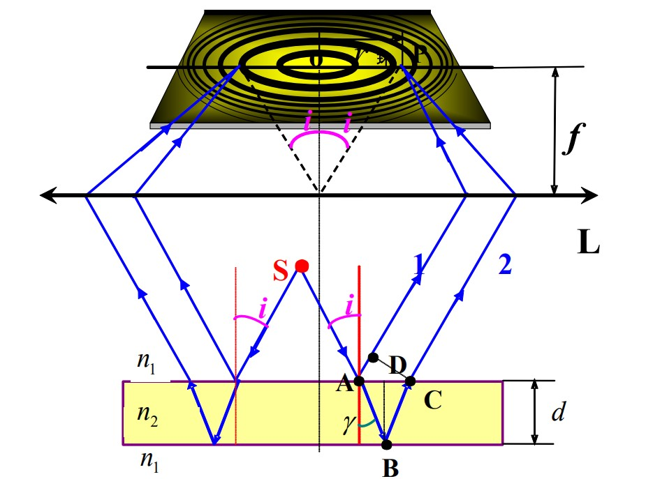
  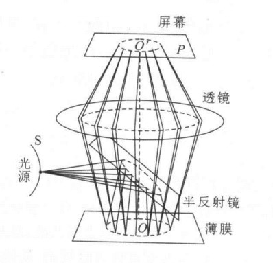
  $\delta = 2d \sqrt{n_2^2 - n_1^2 \sin^2 i} + \frac{\lambda}{2}$
  $R \approx f \sin i \approx fi$

* 单色扩展光源更好：
    1. 每个点光源都形成同心圆环
    2. 每个光源的干涉图样完全重合
    3. 强度非相干叠加，干涉条纹更明亮
   
* 等倾干涉条纹特性
  * 明暗相间同心圆环
  * 内圆级次比外圆级次高
  * 明纹 $ \delta = 2d \sqrt{n_2^2 - n_1^2 \sin^2 i} + \frac{\lambda}{2} = k \lambda$
  * 入射角不变，增加膜厚$d$ 则从中心再冒出一个新亮斑，级次为$k_c+1$ 原来的$k_c$ 变为现在中心亮斑的第一圈亮纹
    增加 $d$ 出现亮斑： $2n \Delta d = \Delta k_c \lambda \quad \Rightarrow \frac{\lambda}{2n}$
  * 干涉条纹内疏外密 $2n_2 d \cos \gamma + \frac{\lambda}{2} = k \lambda$ 得到 $-2n_2 d \sim \gamma \cdot \Delta \gamma = \Delta k \lambda$
    入射角 $i$ 减小，折射角 $\gamma$ 减小， $\Delta \gamma $ 增大，则 $\Delta i$ 增大，又有 $\Delta R = f \Delta i$ ，则入射角小， $\Delta R$ 增大，内疏外密

#### 迈克尔逊干涉仪
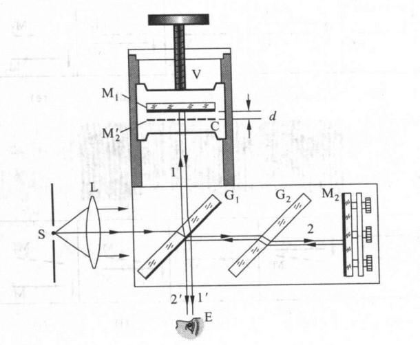

* 条纹移动 $N$ 次，则光程差变化为
  $$
  \delta = N \frac{\lambda}{2}
  $$
* 应用：
  * 测微小位移： $\Delta d = N \frac{\lambda}{2} $
  * 测波长： $\lambda = \frac{2 \Delta d}{N} $
  * 测折射率： $(n-1) l = N \frac{\lambda}{2}$

### 光的衍射
* 分类：
  * 菲涅尔衍射（近场衍射）
  
  
  * 夫琅禾费衍射(远场衍射)
  

* 惠更斯－菲涅耳原理
  * 同一波前上的各点都可以看成是新的振动中心，它们发出的都是相干次波.
  * 空间某点的光振动是所有这些次波在该点的相干叠加.
* 菲涅耳衍射积分公式
设初相为0，面积为 $\Sigma$ 的波面，上面元 $d \Sigma$ 在P点振动为
$$
d E \propto k(\theta) \frac{d \Sigma}{r} \cos \left(\omega t - \frac{2 \pi r}{\lambda}\right)\\
d E =F k(\theta) \frac{d \Sigma}{r} \cos \left(\omega t - \frac{2 \pi r}{\lambda}\right)
$$
其中 $F$ 取决于波面上的波强度， $k(\theta)$ 为倾斜因子

合振动就等于波面所有发出的次波引起的光振动的叠加
$$
E(P) = \int_\Sigma F k(\theta) \frac{\cos \left( \omega t - \frac{2 \pi r}{\lambda}\right)}{r} d \Sigma
$$
#### 夫琅禾费单缝衍射
装置：

* $p$ 点的光强是缝上每一点作为子波源发出的衍射光，在 $p$ 处相干叠加的结果

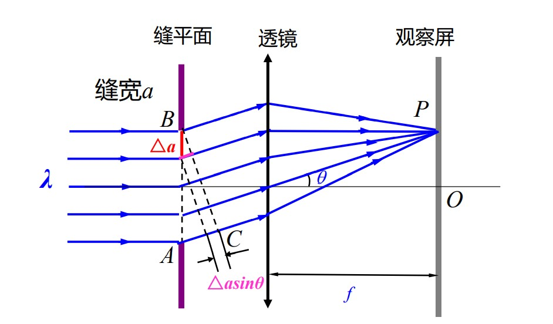

* 由上图有，最大的光程差为 $\delta = a \sin \theta $
##### 半波带法：
  * 中央明纹有 $\delta = 0\quad \theta = 0$ 称为 **主极大** 
  * 当 $a\sin \theta = \lambda$ 时，将缝分为两半波带，两个“半波带”的光在 $P$ 处干涉相消**形成暗纹**
  * 当 $a\sin \theta = 2 \lambda$ 时，将缝分为四个半波带，**形成暗纹**
  * 同理 $a\sin \theta = \frac{3}{2} \lambda$ 分成三个半波带，最终近似为**明纹**
  * **一般情况：** 
$$
\begin{aligned}
    a \sin \theta &= \pm 2k \frac{\lambda}{2} \qquad &\text{暗纹}\\
    a \sin \theta &= \pm (2k + 1) \frac{\lambda}{2} \qquad &\text{明纹}
  \end{aligned}
$$

##### 振幅矢量法（定量）求光强

* 将缝 $N$ 等分，有 $\Delta a = \frac{a}{N}$ ，相邻窄带光程差 $\delta = \Delta a \sin \theta = \frac{a}{N} \sin \theta$ ，相位差 $\Delta \phi = \frac{2 \pi}{\lambda} \delta = \frac{2 \pi a \sin \theta}{\lambda N}$
* $P$ 点形成的光振动： $N$ 个同方向，同频率，同振幅，相位依次相差 $\Delta \phi$ 的简谐振动的合成.

构成圆内接的正多边形，当 $n$ 足够大就看成圆，和振幅为
$$
E_\theta = 2 R \sin \frac{N \Delta \phi}{2} = 2 R \sin \alpha
$$

* 对O点， $\theta = 0 \quad \Delta \phi = 0$
* 和振幅(单个振幅A通过N个等腰三角形得到) $E_0 = N A = N 2 R \sin\frac{\Delta \phi}{2} \approx 2 RN \frac{\Delta \phi}{2} = 2 R \alpha$
$$
\frac{E_\theta}{E_0} = \frac{\sin \alpha}{\alpha}\\
I_\theta = I_0 \left( \frac{\sin \alpha}{\alpha} \right)^2
$$
  其中 $\alpha = \frac{\pi a \sin \theta}{\lambda}$

* 主极大和暗纹位置与半波带法相同
* 次极大： $\frac{dI}{d \alpha} = 0$ 得 $\tan \alpha = \alpha$ ，最终解得 $a \sin \theta = \pm 1.43 \lambda \quad \pm 2.46 \lambda \cdots$ 与半波带有一些偏差

##### 条纹特征
* 中央处为中央明纹，整体为明暗相间的直条纹
* 随着衍射角 $\theta$ 的增大，明条纹的强度减少 (理解：越外侧，分出得半波带数量越多，每份半波带亮度低，最终次极大只剩一份，因此越外侧越暗)
* 单缝衍射明纹角宽度和线宽度
  * 角宽度：相邻暗纹对应的衍射角之差.
  * 线宽度：观察屏上相邻暗纹的距离.
  * 中央明纹角宽度： $\Delta \theta_0 = 2 \theta_1 \approx \frac{2 \lambda}{a}$
  * 中央明纹线宽度: $\Delta x_0 = 2 f \tan \theta_1 \approx 2 f \theta_1 = 2f \frac{2 \lambda}{a}$
  * 第 $k$ 级明纹角宽度： $\Delta \theta_k = \frac{\lambda}{a}$
  * **结论**: 中央明条纹的角宽度是其他明条纹角宽度的两倍
* 其他性质
  * 波长越长，缝宽越小,条纹宽度越宽
  * $\frac{\lambda}{a} \to 0 \quad \Delta \theta_0 \to 0$ 波动光学退化到几何光学
  * 缝位置变化不影响条纹位置分布
* 与干涉比较：
  * 干涉指有限多分立光束的相干叠加；衍射是无穷多子波发出的光波的相干叠加；
  
##### 圆孔的夫琅禾费衍射
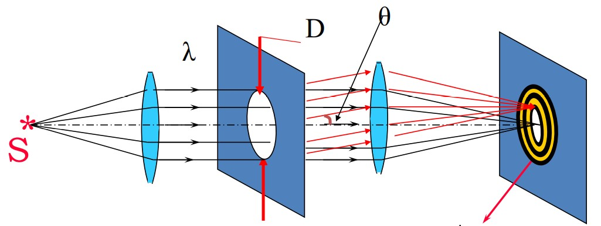

* 艾里斑：由第一暗环所包围的中央亮斑
* 艾里斑的半角宽度： $\theta _0 \approx 1.22 \frac{\lambda}{D}$
* 艾里斑的半径： $r_0 = f \theta _0 = 1.22 \frac{\lambda f}{D}$

##### 光学仪器的分辨本领

* **瑞利判据**：如果一个点光源的衍射图象的中央主极大刚好与另一个点光源的衍射图象第一极小值相重合，认为这两个点光源恰好能为这一光学仪器所分辨.
  

* 最小分辨角：在恰能分辨时，两个点光源在透镜前所张的角度，称为最小分辨角
* $\delta \theta \approx 1.22 \frac{\lambda}{D}$
* 分辨本领： $R = \frac{1}{\delta \theta} = \frac{D}{1.22 \lambda}$
* 增强分辨本领：D增大或 $\lambda$ 减小
* 望远镜： $\lambda$ 不可选择，因此增大D
* 显微镜： 减小 $\lambda$

#### 衍射光栅
* 如果不考虑衍射，双缝干涉光强应该均匀分布
* 考虑衍射，在夫琅禾费衍射下，每个缝的衍射图样位置是相重叠的（有相同的平行的倾斜）

* 原本干涉的光强
$$
I = 2I_0(1+\cos \Delta \phi) = 4 I_0 \cos^2 \frac{\Delta \phi}{2}\\
\Delta \phi = \frac{2 \pi d \sin \theta}{\lambda}
$$
* 考虑衍射， $I_0 \to I_0\left(\frac{\sin \alpha}{\alpha}\right)^2 \qquad \alpha = \frac{\pi a \sin \theta}{\lambda}$
* 实际双缝衍射光强 $I = 4I_0 \left(\frac{\sin \alpha}{\alpha} \right)^2 \cos ^2 \frac{\Delta \phi}{2}$ 其中$\left(\frac{\sin \alpha}{\alpha} \right)^2$称为**衍射因子** $\cos ^2 \frac{\Delta \phi}{2}$ 称为 **干涉因子**
* 双缝干涉条纹各级主极大的**强度**不再相等，而是受**到了衍射的调制** 。

* **光栅**：大量等宽等间距的平行狭缝(或反射面) 构成的光学元件。
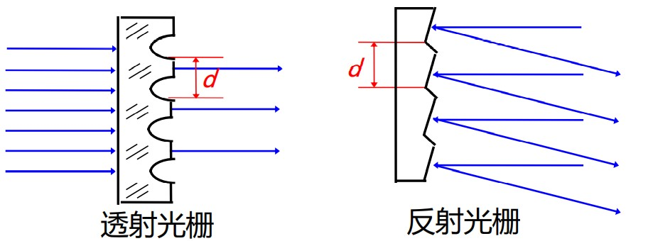

* 光栅常数：
  
  * a 是透光（或反光）部分的宽度
  * b 是不透光（或不反光）部分的宽度
  * 光栅常数(缝间距)：$d = a + b$ （数量级在 $10^{-6} ~ 10^{-5}$）

##### 光栅衍射

* 每个单缝在P点对应的振幅 $E_\theta = E_0 \cdot \frac{\sin \alpha}{\alpha}$
* 相邻狭缝到P点光程差为$\delta = d \sin \theta$，相位差$\delta \phi = \frac{2 \pi}{\lambda} d \sin \theta$
* 假设有N个狭缝，则P点的光振动为N个大小为$E_\theta$，相邻相位差为$\Delta \phi$的光振动的叠加
* 根据叠加公式，P点光强 $E = 2R \sin \frac{N \Delta \phi}{2}$ ，同时 $E_\theta = 2R \sin \frac{\Delta \phi}{2}$ 可得到
$$
E = E_\theta \frac{\sin \frac{N \Delta \phi}{2}}{\sin \frac{\Delta \phi}{2}} = E_0 \cdot \frac{\sin \alpha}{\alpha} \frac{\sin \frac{N \Delta \phi}{2}}{\sin \frac{\Delta \phi}{2}}
$$

* 多缝衍射光强分布公式：
$$
I = I_0 \left(\frac{\sin \alpha}{\alpha}\right)^2 \left( \frac{\sin \frac{N \Delta \phi}{2}}{\sin \frac{\Delta \phi}{2}}\right)^2
$$

  我们令$\beta = \frac{\Delta \phi}{2}$ 有
$$
I = I_0 \left(\frac{\sin \alpha}{\alpha}\right)^2 \left(\frac{\sin N \beta}{\sin\beta}\right)^2
$$

**多缝干涉的图样受到了衍射的调制** ，同样可分出衍射因子和干涉因子
其中 $\alpha = \frac{\pi a \sin \theta}{\lambda} \qquad \beta = \frac{\Delta \phi }{2} = \frac{1}{2} \frac{2\pi}{\lambda} d \sin \theta = \frac{\pi d \sin \theta}{\lambda}$ 

* 只考虑干涉因子
  * 主极大（明纹）：(相邻狭缝相位差为整周期，加强，达到极大) $\Delta \phi = \pm 2k\pi \quad \to \quad \beta = \pm k\pi \quad d\sin \theta = \pm k \lambda$   光栅方程，只决定主极大的位置
  O点光强： $I = I_0 \left(\frac{\sin \alpha}{\alpha} \right) ^2 N^2$ 
  * 极小位置（暗纹）： $\sin N \beta = 0 \quad \sin \beta \neq 0$
    得到 $N \beta = \pm k' \pi \quad \Rightarrow \quad d \sin \theta = \pm \frac{k'}{N}\lambda$ 且 $k' \neq Nk$
    
    * 在相邻的两个主极大之间有 $N-1$ 个极小值
  * 次极大位置：相邻主极大之间有 $N-2$ 个次极大
  * 主极大的角宽度：在 $k' = kN-1$ 和 $k' = kN+1$ 两个暗纹之间，对应 $\Delta k' = 2$
  暗纹条件：

  $$
  d\sin\theta = \pm \frac{k'}{N}\lambda \quad d \cos \theta \Delta \theta = \frac{\Delta k'}{N}\lambda \quad \Rightarrow \quad \Delta \theta = \frac{2 \lambda}{Nd\cos \theta}
  $$
  $N \uparrow$ 主极大角宽度小，主极大更细更亮
  
  * 光栅谱线：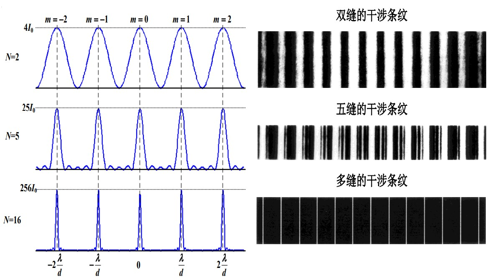

* 干涉因子和衍射因子同时考虑
  * 会出现缺级现象 
  * 主极大明纹： $d \sin \theta = \pm k \lambda$
  * 衍射暗纹条件： $a \sin \theta = \pm n \lambda$
  * 两式相等： $\frac{d}{a} = \frac{k}{n} \quad \to \quad k = \frac{d}{a}n, \quad n=1,2,3$
  * 中央包络线内主极大个数 $2 \frac{d}{a} - 1$

##### 光栅色散
* 入射光包含几种不同波长的光，经光栅衍射后除中央主极大重合外，彼此分开，该现象称为**光栅色散**.
* 光栅衍射产生的按波长排列的谱线——**光栅光谱**

##### 光栅分辨本领
* 将波长相差很小的两个波长 $\lambda$ 和 $\lambda + \Delta \lambda$ 分开的能力.
* 分辨本领定义为 $R = \frac{\lambda}{\Delta \lambda}$
* $\lambda + \Delta \lambda$ 的 $k$ 级主极大正好与 $\lambda$ 的第 $(kN+1)$ 极小重合是两谱线能被光栅分辨的极限，
* 可得 $R = \frac{\lambda}{\Delta \lambda} = kN$
* 增大主极大级次 k 和总缝数 N , 可提高光栅的分辨率.

#### X射线在晶体上的衍射
* X射线: 高速电子撞击物体时产生；本质上也是一种电磁波，波长约为0.001~0.01(nm)
* 1912年，德国物理学家劳厄进行了X射线的晶体衍射实验，看到了X射线的衍射图样
* **布拉格公式：**X射线在同一晶面上的干涉和衍射
  * X射线在同一晶面上的干涉和衍射
    光程差：
    $$
    \delta = AC - BD = h \cos \theta'-h\cos\theta = \pm k \lambda\quad \theta' = \theta
    $$
    干涉加强

  * X射线在不同晶面上的干涉和衍射
    光程差：
    $$
    \delta = AC + CB = 2d \sin \theta
    $$
    反射波相干极大满足 $2d \sin \theta = k \lambda$  布拉格公式

### 光的偏振
* **光矢量**： 电磁波的 $\vec E$ 矢量
#### 五种偏振光
##### 线偏振光
* 光矢量$\vec E$始终在某一个方向振动，这样的光就称为**线偏振光**
* 此时，该方向的光矢量可以像x、y方向分解 （简谐振动两个垂直方向的分解）
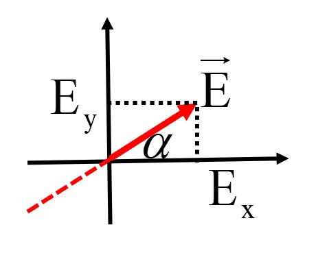

* 两分解振动相位差$\Delta \phi$ 为$0$或$\pi$ 才会有这种线偏振（李萨如图）
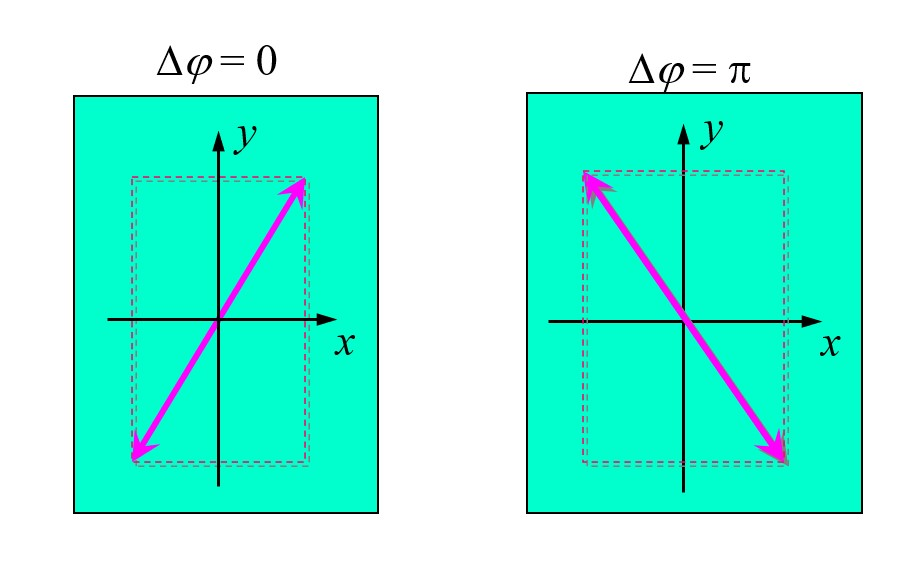

##### 圆偏振光和椭圆偏振光
* 如果在光波传播过程中，光矢量$\vec E$绕着传播方向旋转，其旋转角速度对应光的角频率，并且迎着光的传播方向看去，光矢量的端点轨迹是一个圆，这种振动状态称为圆偏振态，这样的光就称为圆偏振光.

* 圆偏振光：看成振动面相互垂直、相位差为$\frac{\pi}{2}$ 或 $\frac{3\pi}{2}$、振幅相等的线偏振光的叠加.
* 圆偏振光可分为右旋圆偏振光和左旋圆偏振光
* 当振动面相互垂直，但相位差不为特殊值，振幅不一定相等的线偏振光叠加，形成**椭圆偏振光**（同样参见李萨如图）
* 椭圆偏振光也有左右旋
* 表示方法：

##### 部分偏振光
* 介于自然光与线偏振光之间的偏振态称为部分偏振光.
* 它的振动方向也是随机地迅速变化的，但在某一方向的振动占有优势，振幅最大，与之垂直的方向振幅最小.
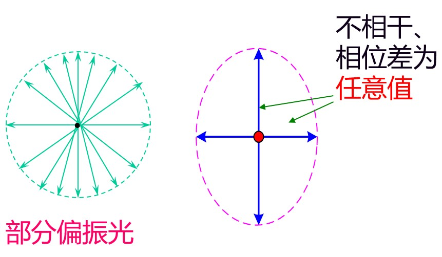

* 这种光可以看成是一个平面偏振光与一个自然光混合而成的

##### 自然光
* 各个方向的光振动全有各个振动方向的强度相等
* 分解到x、y方向，满足 $I_x = I_y = I_0$
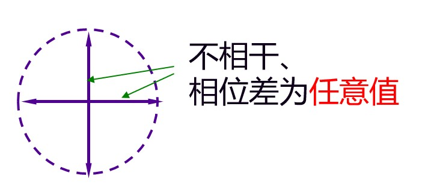

* 自然光表示：

#### 偏振片的起偏和检偏  马吕斯定律

* **偏振片**：能吸收某一方向的光振动，而只让与其偏振化方向一致的光振动通过的一种透明薄片。

* 自然光通过偏振片后变为线偏振光，称为**起偏**。
* 偏振片又可用来检验光线的偏振化程度，称为**检偏**。
* 检偏器示意：
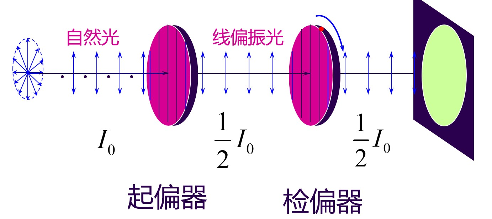

* 结论：当旋转检偏器一周时，会出现两次全明和两次全暗。

##### 马吕斯定律

* 马吕斯定律：入射偏振光的强度为$I_0$，线偏振光透过检偏器后的光强（不计检偏器对光波的吸收）
$$
I = I_0 \cos^2 \alpha
$$
其中 $\alpha$ 为线偏振光的光振动方向和检偏器偏振化方向之间的夹角.

* 该式可通过振幅分解得到
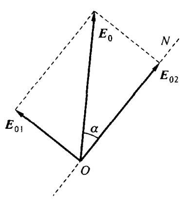

#### 光在反射和折射时的偏振 布儒斯特定律
* 反射光和折射光均为部分偏振光
* 反射光：其中振动方向与入射面垂直的成分较多；折射光：振动方向与入射面平行的成分较多

* 布儒斯特定律：当入射角$i$与折射角$\gamma$之和等于$90^\circ$，即反射光与折射光互相垂直时，反射光成为光振动方向与入射面垂直的线偏振光.

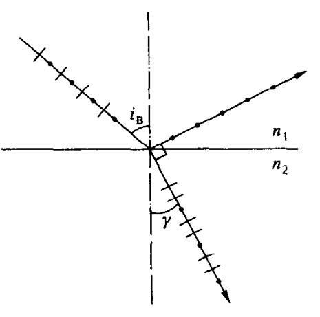

* 布儒斯特角： $\tan i_B = \frac{n_2}{n_1}$
* 采用玻璃片堆可以获得线偏振光.使反射光的强度较高，同时还可以使折射光的偏振度足够高.

### 光的双折射
#### 双折射
* 双折射：一束光入射到各向异性的介质后出现两束折射光的现象
* 双折射(晶体各向异性) -----折射光分成两束,且都是线偏振光

| 寻常光(O光) ordinary |  非寻常光(e光) extraordinary |
|---|---|
| 遵守折射定律  |  不遵守折射定律 |
| 折射光线在入射面内  | 折射光线不在平面内  |
| 在晶体内沿任一方向的速率都相同  | 在晶体内沿任一方向的速率都**不相同**  |

* 光轴：在方解石这类晶体中存在一个特殊的方向，当光线沿这一方向传播时不发生双折射现象。称这一方向为晶体的光轴。
  * 单轴晶体：只有一个光轴（方解石、石英）
  * 双轴晶体：有两个光轴（云母、硫磺）
* 主截面：晶体表面的法线与晶体光轴构成的平面。
* 主平面：晶体中光的传播方向与晶体光轴构成的平面。

主截面的方位由晶体自身特性决定的，且始终垂直于晶体的表面；一般情况下，o光主平面与e光主平面是不重合的。
* 有关偏振：
  * o光的振动方向垂直于它的主平面；
  * e光的振动方向就在它的主平面内。
  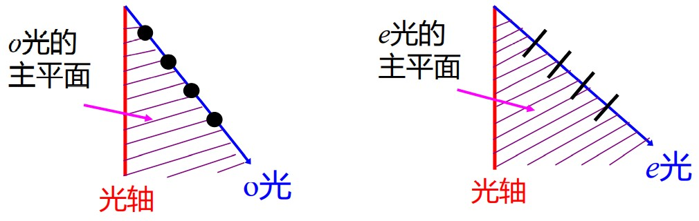
* 光轴在入射面时，o光主平面和e光主平面重合

#### 正晶体和负晶体
* 光的双折射实质上是由于光在晶体中的*传播速率*与光的*传播方向*和光的*偏振状态*有关
* 单轴晶体中的波面：(光线进入晶体后，每一点都会有一个与其相交的光轴，每个时刻将光看成光源，就会有波面)
  * o光沿不同方向的传播速率相同，其波面是球面
  * e光沿不同方向的传播速率不相同，其波面是以光轴为轴的旋转椭球面
  
* 正晶体、负晶体
  * 由于在光轴方向上不发生双折射现象，在光轴方向o光和e光的速率相等，正负差别为椭圆是内切圆或是外切圆，如图.
  

#### 惠更斯作图法
1. 平面波倾斜入射方解石晶体

2. 入射光斜入射，光轴沿垂直纸面方向

3. 垂直入射，光轴沿竖直方向

4. 垂直入射，光轴沿水平方向
