# 数字逻辑与数字系统

[TOC]

## 第一章  开关理论基础

### 数制与码制

* 对N项信息编码，要求二进制代码位数n满足

$$
2^n \ge N
$$

* 常用编码：

  ```mermaid
  graph LR
  base[数字系统编码] --> BCD["BCD码 (Binary Coded Decimal)"] 
  base --> kkx[可靠性编码] 
  base --> ascii["ASCII码 (7位二进制进行编码)"]
  BCD --> 有权码
  BCD --> 无权码
  kkx --> 格雷码
  kkx --> 奇偶校验码
  ```


#### BCD码

##### 有权BCD码

###### 8421码

* 定义：用0000 ~ 1001代表0 ~ 9，1010 ~ 1111冗余。

  | Decimal | Binary | BCD(8421) |
  | :-----: | :----: | :------: |
  |    0    |  0000  |   0000    |
  |    1    |  0001  |   0001    |
  |    2    |  0010  |   0010    |
  |    3    |  0011  |   0011    |
  |    4    |  0100  |   0100    |
  |    5    |  0101  |   0101    |
  |    6    |  0110  |   0110    |
  |    7    |  0111  |   0111    |
  |    8    |  1000  |   1000    |
  |    9    |  1001  |   1001    |

  

* 8421为4位编码的权重，例：3的8421码为0011，那么有$0 \times 8 + 0 \times 4 + 2 \times 1 + 1 \times 1 = 3$

* 对于多位数，直接按位转换，eg：$(28)_{10} = (00101000)_{8421}$

* 运算如果出现进位或算出冗余码，需要加6(0110) 

  eg:
  $$
  8 + 9 = 17 \\
  1000 + 1001 = 10001\\
  \text{计算中出现进位，需要加6}\\
  10001 + 0110 = 10111 = 00010111\\
  (17)_{10} = (00010111)_{8421}
  $$

###### 2421码

* 权值从高到低为2，4，2，1
* 不允许出现0101 ~ 1010 的6个编码
* 取9的自补码，因此执行十进制数相加能正确产生进位信号

| Decimal | 2421码 |
| :-----: | :----: |
|    0    |  0000  |
|    1    |  0001  |
|    2    |  0010  |
|    3    |  0011  |
|    4    |  0100  |
|    5    |  1011  |
|    6    |  1100  |
|    7    |  1101  |
|    8    |  1110  |
|    9    |  1111  |

##### 无权码（余3码）

* 将8421每个码加0011即可的余3码
* 冗余码为：0000、0001、0010、1101、1110、1111
* 也是9的自补码

| Decimal | 余3码 |
| :-----: | :---: |
|    0    | 0011  |
|    1    | 0100  |
|    2    | 0101  |
|    3    | 0110  |
|    4    | 0111  |
|    5    | 1000  |
|    6    | 1001  |
|    7    | 1010  |
|    8    | 1011  |
|    9    | 1100  |

#### 可靠性编码

> 为减少错误的产生，或者能检测出错误 的发生，所设定的码制。

##### 格雷码

* 性质：相邻两个编码只有一位不同，避免编码按顺序增加时多位变化产生的传输错误

* 公式：
  $$
  \left\{
  \begin{aligned}
  G_{n-1} &= B_{m-1} \\
  G_i &= B_i \oplus B_{i+1}\\
  \end{aligned}
  \right.
  $$
  
  eg: 将1101转化为格雷码 
  
  最高位1不变，第三位：$1 \oplus 1 = 0$，第二位$1 \oplus 0 = 1$，第一位$0 \oplus 1 = 1$，则B：1101，G：1011

| Decimal | Binary | Gray Code |
| :-----: | :----: | :-------: |
|    0    |  0000  |   0000    |
|    1    |  0001  |   0001    |
|    2    |  0010  |   0011    |
|    3    |  0011  |   0010    |
|    4    |  0100  |   0110    |
|    5    |  0101  |   0111    |
|    6    |  0110  |   0101    |
|    7    |  0111  |   0100    |
|    8    |  1000  |   1100    |
|    9    |  1001  |   1101    |
|   10    |  1010  |   1111    |

##### 奇偶校验码

* 由两部分组成：信息位和检验位

* 编码方式：奇校验（信息位中1的个数为奇数，校验位为0）、奇校验（信息位中1的个数为偶数，校验位为0）
* 特点
  1. 编码简单
  2. 只有检错能力，没有纠错能力
  3. 只能发现单错，不能发现双错

### 逻辑函数及其描述工具

1. 与运算（逻辑乘）

   函数式：$F=A\cdot B \cdot C$

   逻辑图

    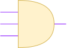 

   VHDL：`F <= A and B and C`
   
2. 或运算

   函数：$F = A + B + C$

   逻辑图
   
   
   
   VHDL：`F <= A or B or C`
   
3. 非运算

   函数：$F = \overline{A}$

   逻辑图
   
   

   VHDL：`F<= not A`
   
4. 复合逻辑运算

   1. 与非

      $F = \overline{AB}$

      `F <= A nand B`

      逻辑图

      

   2. 或非

      $F = \overline{A+B}$

      `F <= A nor B`
      
      
      
   3. 与或非运算
   
      $F=\overline{AB + CD}$
   
   4. 异或
   
      $F = A \oplus B = A\overline B + \overline A B$
   
      `F<=A xor B`
      
      逻辑图
      
      
      
      ==**输入变量有奇数个1，则输出1，否则输出0，可以做奇偶校验**==
      
      同时对于异或，其中一个输入C作为控制端，输出$F = C\oplus A$ 
      
      1. 当$C = 0$ 时，$F = A$
      2. 当$C = 1$ 时，$F = \overline A$
      
      可控制输出是否取反
      
      下图为二进制码转格雷码
      
      
      
      
## 第二章 组合逻辑

**没整**

## 第三章 时序逻辑

### 双稳态触发器（Flip-Flop)

#### RS触发器


* 低有效RS触发器：R、S同时为0称为不定状态（实际不定只会出现在RS=00转化到保持，即RS=11的时候才会出现）

* 次态方程（特征方程）
  $$
  Q^{n+1} = \overline S + RQ^n \\
  S+R = 1 \quad \text{约束条件}
  $$

| $Q^n$  | $Q^{n+1}$  |  R |  S |
|---|---|---|---|
|  0 | 0  | x  | 1  |
|  0 | 1  | 1  | 0  |
| 1  | 0  |  0 | 1  |
| 1  |  1 | 1  | x  |


* 交叉耦合的与非门，S和Q在同一个门对应

* 高有效RS触发器：类比低有效

* 次态方程：
  $$
  Q^{n+1} = S + \overline R Q^n\\
  S \cdot R = 0 \quad \text{约束条件}
  $$

* 交叉耦合的或非门，S和$\overline Q$ 在同一个门对应

* 问题：有不定状态(RS有有约束) 、不能定时控制

#### 电平（同步）D 触发器(锁存器)
   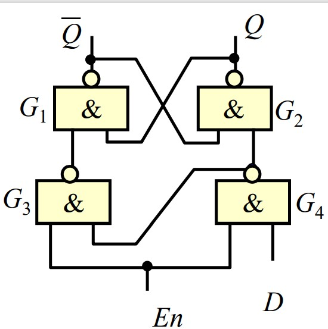
* En＝0时，维持原状态。 En＝1时，**次态方程**：$Q^{n+1} = D$
* 在RS触发器前加入两个与非门，防止RS同时有效出现不定状态
* 空翻：控制信号有效期间内，输出反转多于一次（出现空翻一般认为出现了干扰）
* 问题：有空翻现象、逻辑功能简单

#### 边沿D触发器（寄存器）
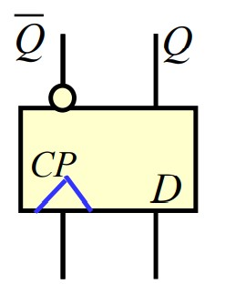
* 相对于锁存器，改电平使能为边沿触发
* 采用上升沿触发。 触发器的次态取决于cp边沿前一瞬间的输入
* 双D边沿触发器，多出$R_d\quad S_d$ 功能如下
  | $R_d$ | $S_d$ | 功能 |
  | ----- | ----- | ---- |
  | 1 | 1 | 工作 |
  | 1 | 0 | 置位 |
  | 0 | 1 | 清零 |
  | 0 | 0 | 不定 |
  

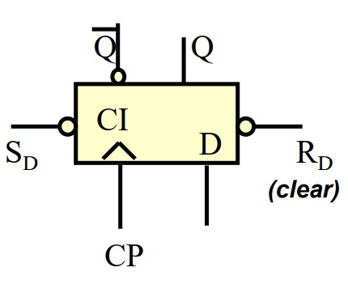
* 可以看出$R_d\quad S_d$ 优先级高，称为异步，不需要时钟配合
* 使用：二进制计数（或二分频）
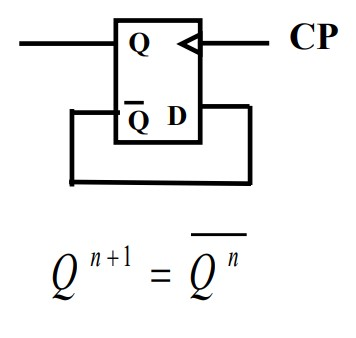


#### 负边沿JK触发器

* **状态方程**
  $$
  Q^{n+1} = J \overline{Q^n} + \overline K Q^n
  $$
* **功能**：J = K = 0 具有维持功能 ， J = K = 1 具有状态翻转功能（来一个时钟(CP) 下降沿，翻转一次），JK不等，不管现态如何次态与J相同
状态表：

| J | K | $Q^n$ | $Q^{n+1}$ |
| ---- | ---- | ---- | ---- |
| 0 | 0 | 0 | 0 |
| 0 | 0 | 1 | 1 |
| 0 | 1 | 0 | 0 |
| 0 | 1 | 1 | 0 |
| 1 | 0 | 0 | 1 |
| 1 | 0 | 1 | 1 |
| 1 | 1 | 0 | 1 |
| 1 | 1 | 1 | 0 |

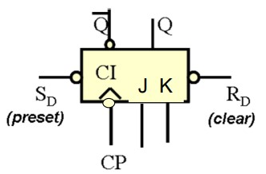
* 和[边沿触发器](#边沿触发器（寄存器）) 类似，有清零和置位

使用例子：
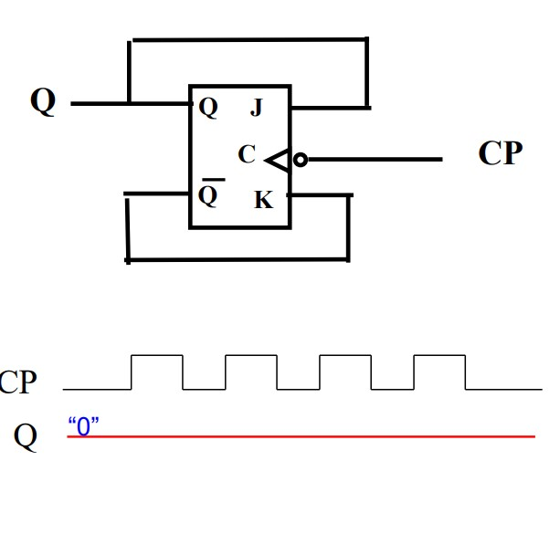

构成
#### 上升沿 T 触发器
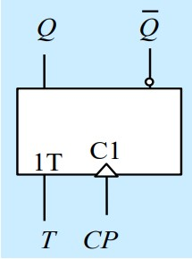
* 逻辑： $Q^{n+1} = T \overline{Q^n} + \overline{T}Q^n = T \oplus Q^n$
* 对比JK，把JK的J和K并在一起接T（但触发不同，一个上升沿触发，一个下降沿）
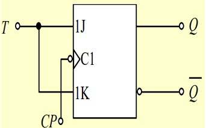

类似的jk还可变为D触发器


* T=0 保持，T=1触发器在CP作用下翻转

| $T$  | $Q^n$  | $Q^{n+1}$ |
|---|---| --- |
|  0 | 0  | 0 |
|  0 | 1  | 1 |
|  1 | 0  | 1 |
|  1 | 1  | 0 |

### 时序电路的分析
#### 时序电路的特点
* **逻辑功能**：任一时刻的输出状态，不仅取决于当时的输入信号，而且与前一时刻电路的状态有关。
* **电路结构**：组合电路＋ 触发器。
  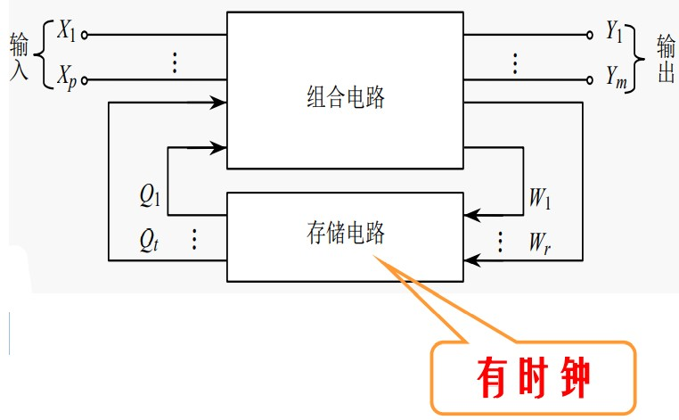
* 触发方式分类：
  * 同步时序电路：所有触发器共用一个时钟信号。
  * 异步时序电路：触发器无统一的时钟信号。
* 输出方式分类：
  * 莫尔型（Moore）：输出 Y 仅与电路的现态有关（式中无x）
  * 米勒型（Mealy）：输出 Y 是电路现态和外部输入量的函数。
* 时序电路可以用三个方程描述：
$$
\begin{aligned}
  Y &= F_1 (X,Q^n) \quad &\text{输出方程}\\
  W &= F_3 (X,Q^n) \quad &\text{激励方程}\\
  Q^{n+1} &= F_2 (W,Q^n) \quad &\text{状态方程}\\
\end{aligned}
$$

#### 同步时序电路的分析方法
* 目的：得到电路状态 、外部输出的变化规律，逻辑功能。
* 步骤
  1. 确定输入、输出信号
  2. 输出方程、驱动方程、状态方程
  3. 计算真值表
  4. 状态图
  5. 确定电路逻辑功能

* 状态图：
  * 主循环：状态图中状态多的循环
  * 有效状态：主循环中的状态。
  * 无效状态：不在主循环中的状态。
  * 自启动：无效状态在CP脉冲作用下能进入主循环。
  * 箭头旁1/0意义(具体见[状态图](#状态))：输入1，输出0
* 如果上电后只能在无效循环里称电路为**挂起**
* 时序图（波形图）：在CP和外部输入的作用下，电路状态、输出随时间变化的波形图。
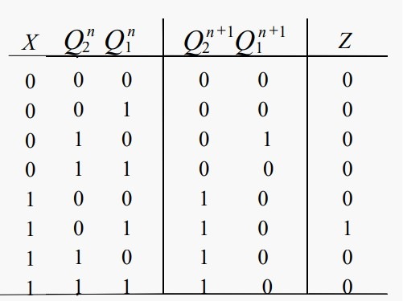

状态图


* 功能描述：序列信号检测器，该电路可重叠检测序列101(X输入依次为1、0、1后会被检测)
* 可重叠：如果输入1010101，会输出3个1，其中输入的第二、第三个1被重复使用检测

### 锁存器和寄存器
#### 锁存器
* 用来暂时存放二进制代码或数据的电路。
* 典型芯片：集成三态输出8位锁存器74LS373


* 引脚功能
  * D：数据输入
  * G：输入使能
  * Q(LE)：数据输出
  * OE：输出使能

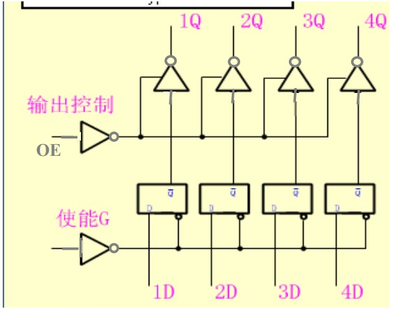

* 锁存器使用：输入有效数据的稳定滞后于锁存信号 （门先打开，在打开的时间段内，输入信号达到稳定即可）

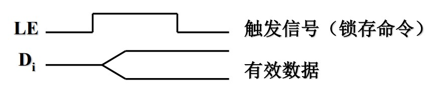
#### 寄存器
* 用来暂时存放数据或代码

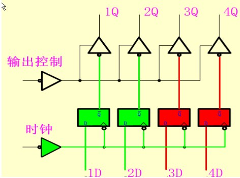
* 典型芯片：集成三态输出8位寄存器74LS374

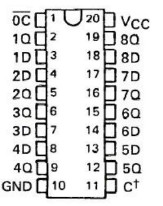
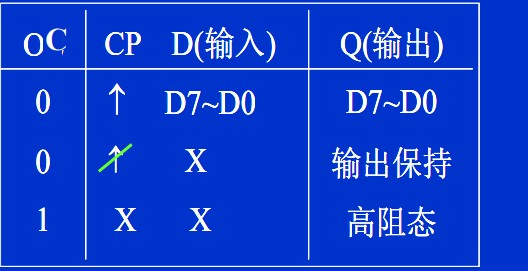
* 寄存器使用：输入的有效数据的稳定先于打入脉冲


#### 移位寄存器


* 在CP作用下，将所存的代码移至紧邻的左一位或右一位
$$
Q_0^{n+1} = D \quad Q_1^{n+1} = Q_0^{n} \quad Q_2^{n+1} = Q_1^{n} \quad Q_3^{n+1} = Q_2^{n}
$$
* 可用于串并转换
* 双四位移位寄存器CC4015
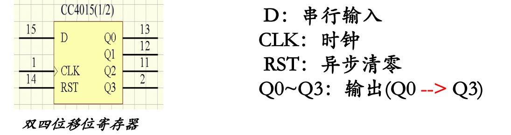
* 工作示意：可用JK触发器或D触发器构成移位寄存器，实现串行转并行


##### 移存型计数器
###### 环型计数器 (Ring Counter)

* 将移存器的最后一级输出反馈到第一级的输入

* 取状态只有一个 1或0 的为主循环，4进制计数器。不需要译码
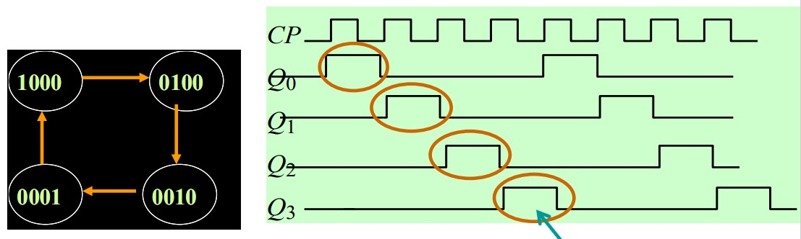
* 特点
  * n 位移存器，可构成 模 M＝N 的环形计数器。
  * 缺点：无自启动能力，电路利用率不高。在计数开始之前，预置 $Q_0 Q_1 Q_2 Q_3＝1000$ ，进入主循环。
  * 优点：不需要译码器，输出顺序脉冲。

###### 扭环形计数器 (Johnson Counter)
* 将移存器的最后一级输出反相后接到第一级的输入。

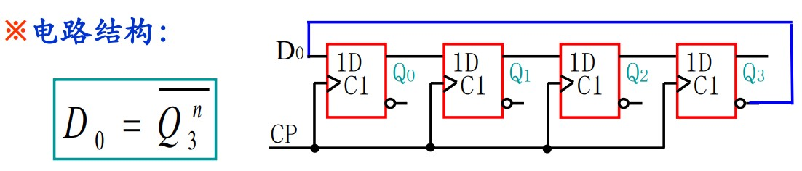

* 取格雷码计数状态为主循环，模 M＝8 的计数。

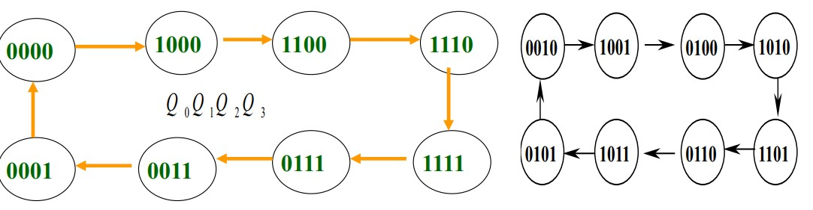


* 电路特点
  * 优点：
    * 扭环形计数器的模 M＝2N ，提高了电路利用率；
    * 电路状态译码时不会产生竞争－冒险现象。
  * 缺点：
    * 无自启动能力。在异步清零0000，进入主循环

###### 中规模 8位双向移位移存器－－74LS299
* 芯片示意

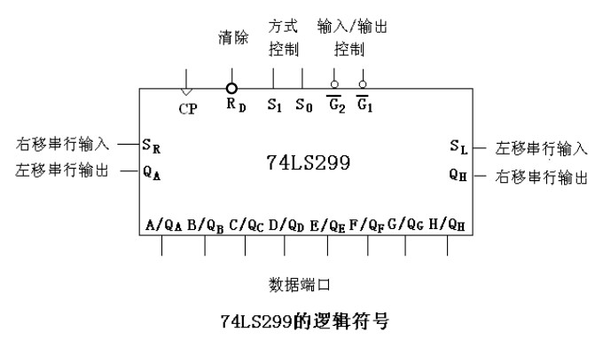
* 说明：
  * $R_D$ 异步清零
  * $G_2\quad G_1$ 控制数据端口是输入还是输出：
    * $G_2=G_1=0$ 输出引脚
  * CP：上升沿触发
  * $S_1 \quad S_0$ 控制四种工作方式：保持(00)，并行置数(11)，右移(01)，左移(10)
  * 工作时：右移为例，数据端口统一右移，最右侧H通过右移串行输出$Q_H$ 移出；同时，A通过左边右移串行输入$S_R$ 移入
  * 并行置数 时钟上升沿把数据端口八个数存储


* 应用：7位并行转串行 （图中 $D_0 \sim D_6$ 七位按顺序 $D_6 D_5D_4D_3D_2D_1D_0$ ）

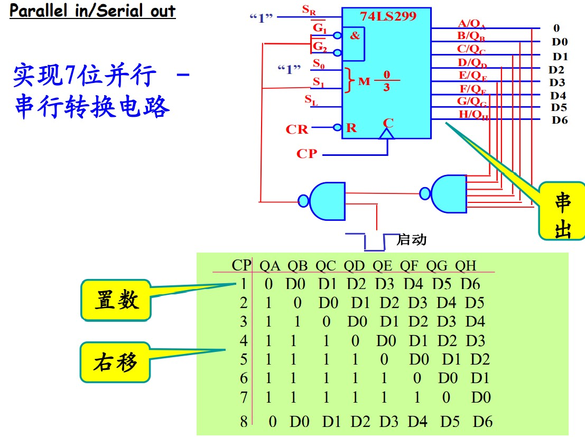

* 应用：8位串行转并行


移位同样可以看作幂运算，左移n位乘 $2^n$ 右移除 $2^n$

### 中规模计数器 (Counter)
#### 集成同步二进制计数器
##### 四位二进制加计数器（ 74LS161/163 ）
* 不同
  * 74LS161采用异步清零方式。
  * 74LS163采用同步清零方式。(需要时钟触发)

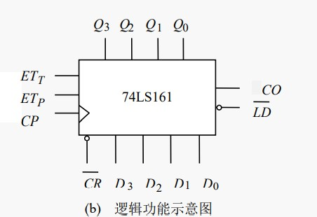
* 说明：
  * CR：异步清零
  * LD(Load)：低有效，并行置数端(同步置数)，把输入直接置到输出
  * EP、ET：使能，高有效，同时有效开始计数，从0000到1111
  * CO：进位输出，计数到1111后，进位产生高电平1（到1111就变成1）
  * 使能端有一个为0，进入保持状态，不计数
  * 记录时钟上升沿个数
  * 对于特殊情况，处于保持状态且输出为1111，对于进位输出，如果 ET=1，那么进位输出为1，否则为0，此时相当于 $CO = ET\cdot Q_3Q_2Q_1Q_0$
  * 计数器型号：奇数结尾都为16进制，偶数10进制
  
  

###### 容量扩展
* 用四位二进制计数器构成 $4\cdot n$ 位 二进制计数器
* **同步级联**（只适用于有使能端计数器）
* CP 同时接在各片计数器的时钟输入端
* 级联步骤：
  1. 排列计数器高低位的顺序；
  2. 找到低位向高位的进位信号；

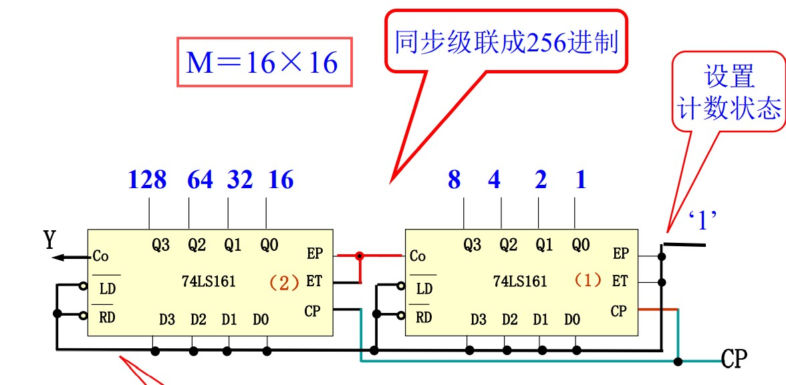

##### 同步二进制可逆计数器（74191）
* 逻辑功能：计数器可逆，异步置数，计数器状态可控，进位（借位）负脉冲输出，最大（最小）标志输出 。
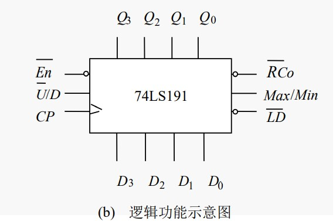
* 说明：
  * En使能，低有效
  * Max/Min 是最大或最小状态标志
  * **RCo：进位或借位，En、 RCo：用于同步级联。**：
    * 加法计数时，计数到1111，最大最小标志为1时，该位为0
  * $\overline{U}/D$ ：控制加计数或减计数，低电平为U(Up)有效 加法计数，反之D(Down) 有效，减法计数
  * LD：并行置数，异步
  * 特殊情况，如计数到1111后使能无效，不再计数或进位
    * $En=0 ,\quad \max / \min = 1 ,\quad R_{Co} = 0$
    * $En=1 ,\quad \max / \min = 1 ,\quad R_{Co} = 1$ 停止计数，无效电平
  


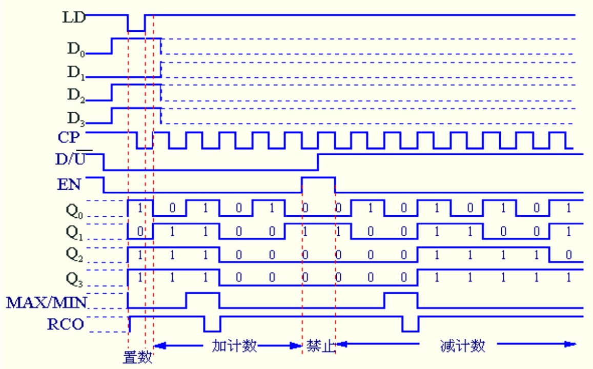
注意：RCo有效的只有半个时钟周期（实际是通过Max/Min和时钟与得到）
* 级联：构成 $4\times n$ 位 计数器


##### 集成同步十进制计数器
* 有三种：
  * 74160：异步清零方式。
  * 74162：同步清零方式。
  * 74190：单时钟十进制同步可逆计数器，其引脚排列图和逻辑功能示意图与74191相同。


* 端口功能可以类比161


* 级联可组成8421码100进制


##### 用中规模计数器构成任意进制计数器

方法：

###### 清零法
* 自然态序M进制计数器（0～M-1)，利用复位端和置数端(load 0000)实现归零。
  1. 用同步复位端（置数端）归零（在M-1状态复位）
  2. 用异步复位（置数端）归零（在M状态复位）：亚稳态。

#### 计数器应用
##### 顺序脉冲（节拍）发生器
* 组成：计数器＋译码电路

* 计数器的M个状态，产生M路脉冲


1. **环形计数器构成的节拍发生器**
* 特点：
  * 结构简单，不必附加译码电路。
  * 但使用的触发器数目多，M路顺序脉冲用了M个触发器。

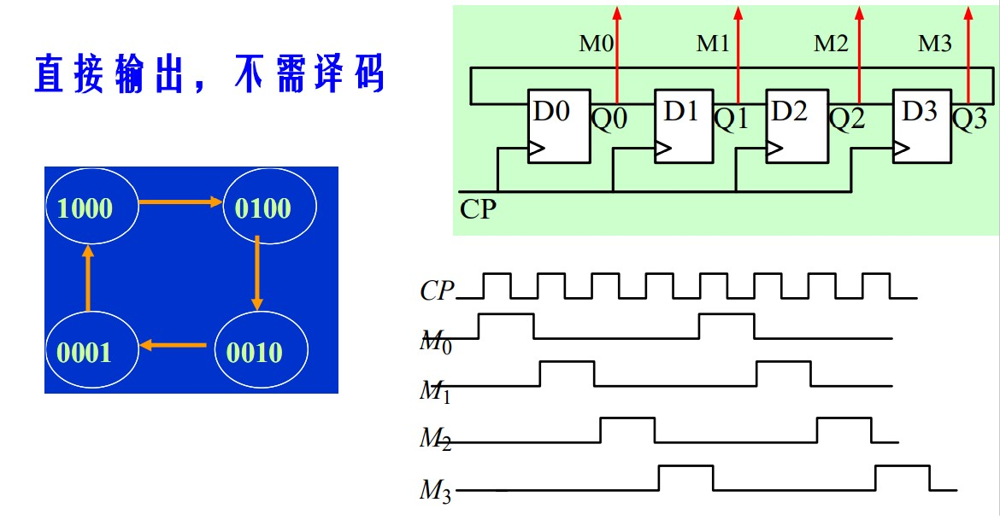

2. **扭环形计数器构成的节拍发生器**

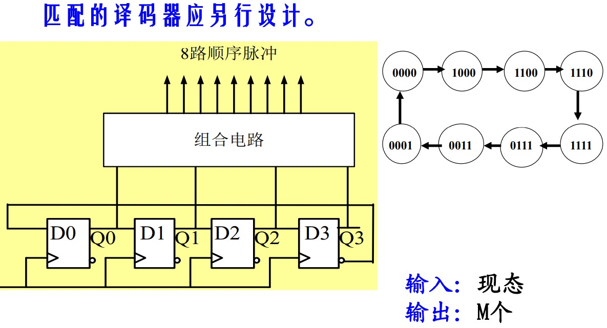
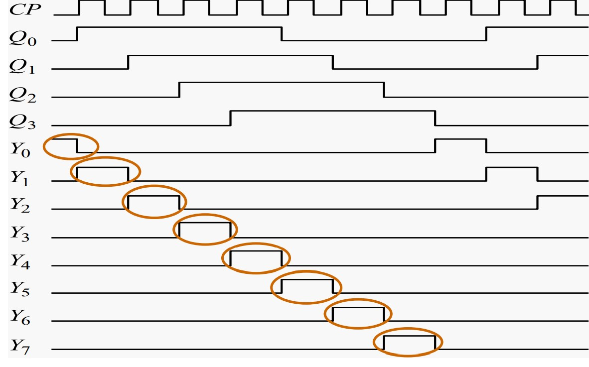
* 可以看出是格雷码计数，不会有竞争冒险，消除毛刺
* 特点：
  * 计数器采用扭环型计数器可从根本上消除竞冒险现象，
  * 译码电路简单。
  * 但电路利用率较低

3. **自然态序计数器构成的节拍发生器**
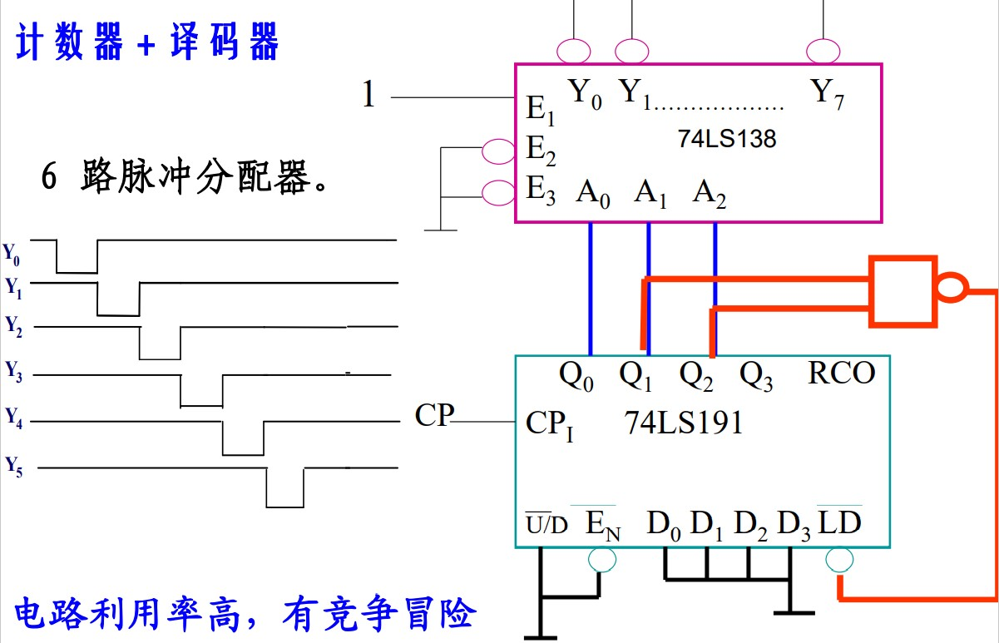
注：138  38译码器；191异步置数计数器
* 不是格雷码，会有毛刺


* 解决：
  * 控制使能端
  * 不用自然态序计数，用格雷码

##### 序列信号发生器
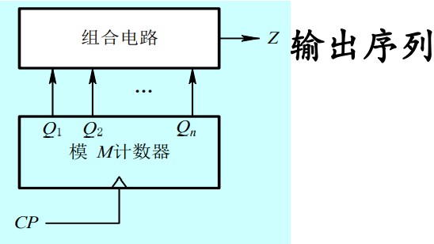

利用计数器等，和数据选择器组合，输出循环的序列信号，例如：
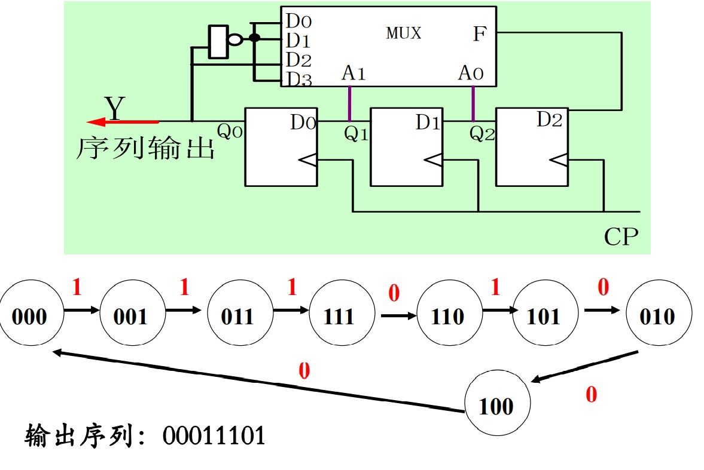

### 同步时序电路的设计
* 关键：
  * 确定应有的状态转换规律；
  * 根据状态转换规律，求得触发器的激励信号表达式。
* 步骤：
  1. 设计要求
  2. 原始状态图
  3. 化简为最简状态图
  4. 状态编码
  5. 选触发器，求输出、驱动方程
  6. 画电路图
  7. 检查电路能否自启动

详细步骤说明
1. 逻辑抽象，得状态图（表）：
   * 输入输出
   * 系统状态数
   * 每一状态在规定条件下的转移方向
2. 状态化简：
   * 等价状态 —— 如果有两个或两个以上状态，在相同的外部输入下，各自的外部输出相同，次态相同，则这几个状态为等价状态。应把等价状态归并为一个。
3. 状态编码，得真值表：
   * 将化简后的各状态用二进制代码来表示。
   1. 确定触发器个数
   2. 状态分配
   3. 写出编码形式的状态转换真值表
4. 由状态图（表）得驱动方程和输出方程
   1. 填卡诺图
   2. 化简卡诺图得激励方程、输出方程

* 例：用D触发器设计一个五进制的加法计数器。
  1. 原始状态图：无输入信号，有进位输出C，有5个状态分别表示0 — 4。
  2. 状态化简：无需化简。
  3. 状态编码：触发器个数 $n=3$ ；状态分配：按自然态序编码；写出编码形式的状态图、真值表
  4. 写出输出方程和驱动方程：
   * 输出方程： $C=Q_2^n$
   * 驱动方程：对于 D 触发器，要求状态方程最简
  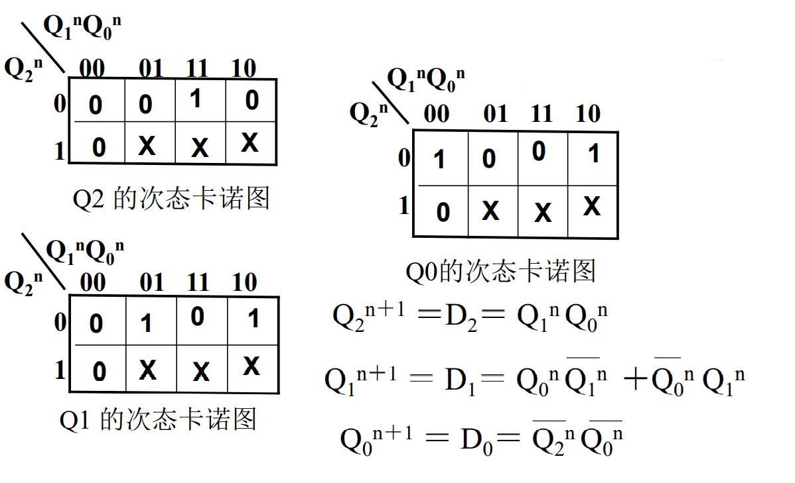
  5. 画出逻辑图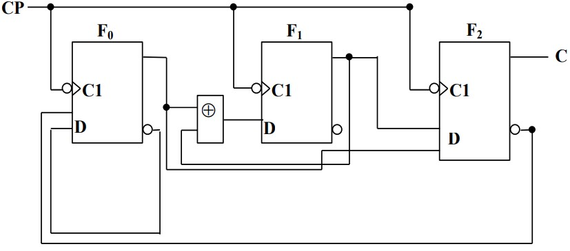
  6. 检查自启动：将无效状态101、110、111代入状态方程计算：电路能够自启动


## 附
* 一个端口接两根线表示两个信号与运算
  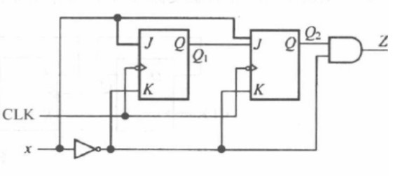
* 端口悬空认为输入逻辑“1”
