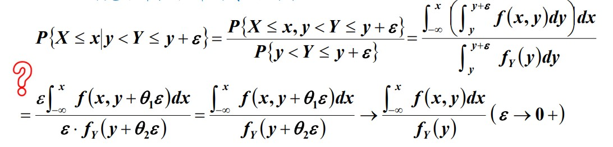

# 概率论与数理统计

[TOC]

## 概率论基本概念

### 条件概率

* 全概率公式：
  $$
  P(A) = P(B_1)P(A|B_1)+ P(B_2)P(A|B_2) + \cdots + P(B_n)P(A|B_n) = \sum_{j=1}^n P(B_n)P(A|B_n)
  $$

* 贝叶斯公式：
  $$
  P(B_i|A) = \frac{P(AB_i)}{P(A)} = \frac{P(B_i)P(A|B_i)}{\sum_{j=1}^n P(B_j)P(A|B_j)}
  $$
  

### 独立性

#### 两事件独立性

* 已知事件B发生，不影响事件A的概率
  $$
  P(A|B) = P(A)
  $$
  这时称A、B独立

* **定义：**若两事件满足 $P(AB) = P(A)P(B)$ 则称A、B相互独立。

* 充要条件：A、B为两事件，且$P(A) > 0$ 若二者独立，则$P(B|A) = P(B)$ 

* 若A、B独立，则下列各对事件也相互独立
  $$
  A \text{ and }\overline{B} \qquad \overline{A} \text{ and }B \qquad  \overline{A} \text{ and }\overline{B}
  $$

* 判断独立性三种方法

  1. 根据定义 $P(AB) = P(A) P(B)$
  2. 计算条件概率 $P(A) = P(A|B)$
  3. **根据实际意义** 

* 和事件简单：互斥、互不相容时 $P(A \cup B) = P(A) + P(B)$

  积事件简单：相互独立 $P(AB) = P(A)P(B)$

* 实例：

  扑克牌中抽牌——放回抽取，抽取相互独立；不放回，抽取不独立，第一次回影响第二次抽取的结果

* 对比：

  ​	独立——$P(AB) = P(A) P(B)$

  ​	互斥——$AB = \varnothing$

#### 三事件独立性

* 定义：满足等式
  $$
  \left\{
  \begin{aligned}
  P(AB) &= P(A)P(B) \\
  P(BC) &= P(B)P(C) \\
  P(AC) &= P(A)P(C) \\
  \end{aligned}
  \right.
  $$
  称三事件为**两两独立**的事件

  满足
  $$
  \left\{
  \begin{aligned}
  P(AB) &= P(A)P(B) \\
  P(BC) &= P(B)P(C) \\
  P(AC) &= P(A)P(C) \\
  P(ABC) &= P(A)P(B)P(C)
  \end{aligned}
  \right.
  $$
  称事件**相互独立**

  ***相互独立可以得到两两独立，反之不行***

* 两两独立但不相互独立:

  下图折叠成三棱锥。 三棱锥的三个面分别涂着红、黄、蓝三种颜色， 第④个面同时包含红、黄、蓝三种颜色。

  抛掷这个三棱锥， 记

  A={向下的面中包含红色}， 

  B={向下的面中包含黄色}， 

  C={向下的面中包含蓝色}。

  可以验证
  $$
  P(AB) = P(A)P(B) \\
  P(BC) = P(B)P(C) \\
  P(AC) = P(A)P(C) \\
  P(ABC) \neq P(A)P(B)P(C)
  $$
  

* 设$A_1,A_2,\ldots,A_n$ 为$n$ 个事件，如果对于任意的$k(1 < k \leq n)$ 和任意的 $1 \leq i_1 \leq i_2 \leq\cdots \leq i_k \leq n$ 有等式
  $$
  P(A_{i_1} A_{i_2} \cdots A_{i_k}) = P(A_{i_1}) P(A_{i_2}) \cdots P(A_{i_k})
  $$

## 连续随机变量及其概率密度

* 分布函数$F(x)$ 和概率密度函数$f(x)$有
  $$
  F(x) = \int_{-\infty}^x f(x)\dd x
  $$
  

* **重要** ：
  $$
  \int_{-\infty}^\infty e^{t^2} \dd t = \sqrt{\pi}
  $$

### 正态分布

* $\Phi(X)$ 为标准正态分布的分布函数
* 如果 $X \sim N(\mu,\sigma^2)$ 那么 $Z=\frac{X-\mu}{\sigma} \sim N(0,1)$
* 由以上有 $F_X(x)=P\{X\leq x\} = P\left\{ \frac{X-\mu}{\sigma}\leq \frac{x-\mu}{\sigma} \right\} = \Phi(\frac{x-\mu}{\sigma})$ 
* 标准正态分布的**重要性**在于，任何一个一般的正态分布都可以通过线性变换转化为标准正态分布。
* $3\sigma$ 准则：当 $X\sim N(0,1) $ 有
$$
P(|X|\leq 1) = 2\Phi(1)-1 = 0.6826\\
P(|X|\leq 2) = 2\Phi(2)-1 = 0.9544\\
P(|X|\leq 3) = 2\Phi(3)-1 = 0.9974\\
$$

* $X \sim N(0,1)$ ，若数 $z_\alpha$ 满足： $P\{X>z_\alpha\} = \alpha,0<\alpha<1$ 称 $z_\alpha$ 为标准正态分布上的 $\alpha$ 分位点
* 由图形的对称性知： $z_{1-\alpha} = -z_\alpha $

### 随机变量的函数的分布
* 求概率密度：已知 $f_X$ 和 $Y = g(X)$ ，那么
$$
F_Y(y) = P(Y<y) = P(g(X)<y) = P(X<g^{-1}(y)) = F_X(g^{-1}(y))
$$
求导可得概率密度函数

$$
f_Y = \frac{d F_Y(y)}{dy} = \frac{d F_X(g^{-1}(y))}{dy} = f_X(g^{-1}(y)) \cdot g^{-1} {'} (y)
$$

## 多维随机变量及其分布

### 边缘分布
* 对于多元随机变量，其每个维度也为随机变量，也有各自的分布函数，称为**边缘分布函数**
$$
F_X(x) = P(X\leq x) = P(X\leq x,Y\le +\infty ) = F(x,+\infty)
F_Y(y) = P(Y\leq y) = P(X\leq +\infty,Y\le y ) = F(+\infty,y)
$$

### 条件分布
* 条件分布是条件概率在另一种形式下的重复
$$
P\{X=x_i|Y=y_j\} = \frac{P\{X=x_i,Y=y_i\}}{P\{Y=y_i\}} = \frac{p_{ij}}{p_{\cdot j}}
$$

* 条件分布律是一种分布律，它具有分布律的一切性质
* 条件概率密度
$$
f_{X|Y}(x|y) = \frac{f(x,y)}{f_Y(y)}
$$
* 称 $\int_{-\infty}^x f_{X|Y}(x|y)dx $ 为 $Y=y$ 的条件下 X的**条件分布函数**
* 对于条件概率密度定义中，克服单点概率为零的困难： $P\{X\leq x | Y=y\}=\lim_{\epsilon \to 0^+}P\{X \leq x | y \le Y \leq y+\epsilon\} $

#### 二维正态分布
##### 定义
* 概率密度 
$$
f(x,y) = \frac{1}{2\pi \sigma_1 \sigma_2 \sqrt{1-\rho^2}} \exp\left\{\frac{-1}{2(1-\rho^2)} \left[\frac{(x-\mu_1)^2}{\sigma_1^2} - 2\rho \frac{(x-\mu_1)(y-\mu_2)}{\sigma_1 \sigma_2} + \frac{(y-\mu_2)^2}{\sigma_2^2}\right]\right\}
$$
其中 $\mu_1 ,\mu_2 \in R \quad \sigma_1,\sigma_2>0 \quad |\rho| \leq 1$

* $(X,Y)\sim N(\mu_1,\mu_2,\sigma_1,\sigma_2,\rho) $ 同时有  $X\sim N(\mu_1,\sigma_1^2)$   $Y\sim N(\mu_2,\sigma_2^2) $  ，对于相关系数：正数正相关，负数负相关（可以认为正相关：X较大时，Y的趋势是取较大的数），0独立
* 若$(X,Y)$是连续型随机变量，对任意的 $x,y$ ,有 $f (x, y) = f_X (x) f_Y (y)$ 几乎处处成立，则称$X$和$Y$相互独立。
* 二维正态分布边缘分布 $X \sim N(\mu_1,\sigma_1^2) $  $Y \sim N(\mu_2,\sigma_2^2) $ 
* 二维正态分布条件分布 $Y=y$ 条件下 $X \sim N(\mu_3,\sigma_3^2) $  $X=x$ 条件下 $Y \sim N(\mu_4,\sigma_4^2) $  其中
$$
\mu_3 = mu_1 + \rho \frac{\sigma_1}{\sigma_2}(y-\mu_2) \qaud \sigma_3 = \sigma_1(1-\rho^2) \\
\mu_4 = mu_2 + \rho \frac{\sigma_2}{\sigma_1}(x-\mu_1) \qaud \sigma_4 = \sigma_2(1-\rho^2) 
$$

##### 性质
* 线性性质： 
  * 若常数 $a,b \quad a^2 + b^2 \neq 0$ 则 $aX+bY$ 服从一维正态
  * 常数 $a,b,c,d$ 有 $\begin{vmatrix}
    a & b\\ c& d
  \end{vmatrix} \neq 0$ 则 $(aX+bY, cX+dY) $ 服从二维正态分布

### 独立性
* 两个随机变量相互独立时，它们的联合分布函数等于两个边缘分布函数的乘积。
* 若$(X,Y)$是连续型随机变量，对任意的 $x,y$ ,有 $f (x, y) = f_X (x) f_Y (y)$ 几乎处处成立，则称$X$和$Y$相互独立。